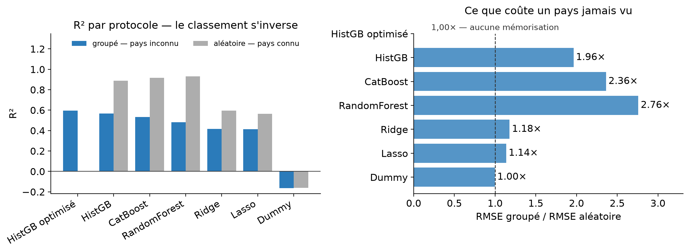
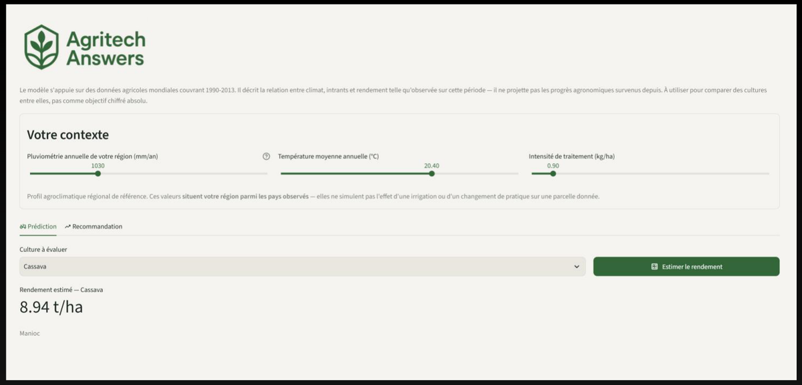
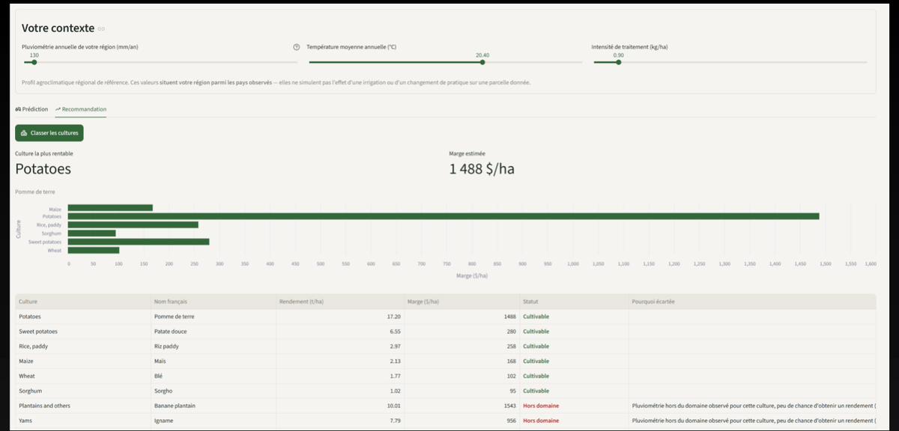
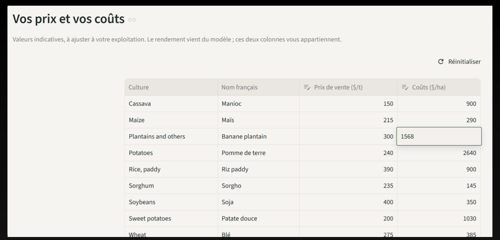
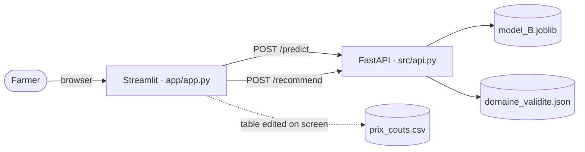
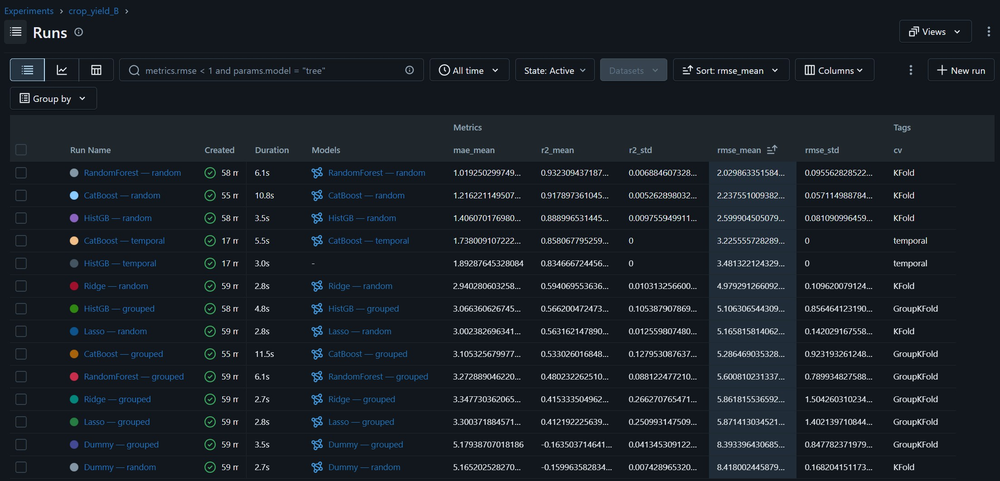
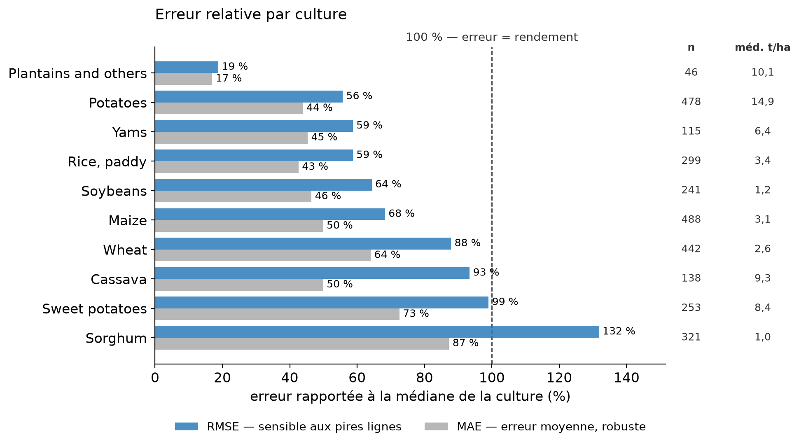
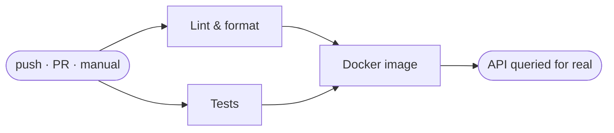

<a id="readme-top"></a>

<div align="center">


# Crop Predict — Yield Prediction & Crop Recommendation

**One model, served by an API, queried by an interface — to help a farmer decide what to sow.**

*OpenClassrooms project P12 — "Design a recommender system with multi-source data integration"*

[](https://github.com/KL38/OC_P12_ML_MLOPS_Predict-Crops-rentability/actions/workflows/ci.yml)
[](https://www.python.org/)
[](https://fastapi.tiangolo.com/)
[](https://streamlit.io/)
[](https://www.docker.com/)
[](https://mlflow.org/)

</div>

The application does two things through a single interface. **Predict** — the user picks a crop,
describes their region, and gets an expected yield. **Recommend** — the user describes only their
conditions, and the ten crops come back ranked by estimated profit.

It is **one model called two different ways**: `/recommend` is `/predict` run over the ten crops of
the same context, plus a business layer. No second model, no second training run.

---

## 📊 Results

### What following the model earns

A recommender is only worth something if it beats a **single blanket rule** — "always sow whatever
is most profitable in general" — which needs no model at all. Both advisers are compared over the
**488 situations** (country, year) in the test set where several crops were actually grown, then
paid out at the profit **actually observed** on the ground. The model is never judged on its own
predictions.

| Advice followed | Mean real profit | Median |
|---|---:|---:|
| Single blanket rule — the same crop everywhere | 2 263 \$/ha | 1 756 \$/ha |
| **Model** — the crop with the best locally predicted profit | **2 344 \$/ha** | **1 910 \$/ha** |
| Best possible choice — theoretical ceiling | 2 629 \$/ha | 2 029 \$/ha |

> **Following the model earns +81 \$/ha, or +3.6 %** — at no cost to the farmer. It is the same
> sowing, decided differently.

### How good the model is

**HistGradientBoosting** trained on `log(yield)`, picked from five model families across 14
experiments tracked in MLflow.

| | Value |
|---|---|
| Cross-validation protocol | `GroupKFold(5)` **by country** |
| CV R² — before tuning | 0.566 |
| CV R² — **after tuning** | **0.595** |
| **Test R² — 22 countries never seen** | **0.627** |
| Test RMSE | **4.94 t/ha** |
| Test MAE | 2.85 t/ha |
| Training | 11 550 rows, 87 countries, 1990-2013, 10 crops |
| Test | 2 821 rows, 22 countries **never seen** |

### Why those numbers are the honest ones

<div align="center">
  
  <br />
  <em><b>Left:</b> the ranking inverts between the two protocols. <b>Right:</b> what an unseen
  country costs each model — the <code>Dummy</code> control sits at exactly 1.00×, because a model
  that learns nothing has nothing to memorise.</em>
</div>

Rainfall is constant per country over 1990-2013 (η² = 100 %) and temperature nearly so (99.6 %):
the (rainfall, temperature) pair **reconstructs the country exactly**. Put the same country on both
sides of a split and the evaluation becomes a table lookup. Every figure above is therefore measured
with countries held out — the lowest numbers available, and the only meaningful ones.

[**→ The full argument, with the control that makes it airtight**](#-country-grouped-validation)

---

<details>
<summary>📑 Table of contents</summary>

- [Results](#-results)
- [The application](#-the-application)
- [Architecture](#-architecture)
- [The model](#-the-model)
  - [Country-grouped validation](#-country-grouped-validation)
  - [What drives the prediction](#-what-drives-the-prediction)
  - [Where the profit comes from](#-where-the-profit-comes-from)
  - [Experiment tracking](#-experiment-tracking)
  - [Known limitations](#-known-limitations)
- [Getting started](#-getting-started)
- [CI pipeline](#-ci-pipeline)
- [Repository layout](#-repository-layout)
- [Data sources](#-data-sources)

</details>

## 🖥️ The application

Two tabs over one model, plus a price table the farmer owns.

<div align="center">
  
  <br />
  <em><b>Predict.</b> Three sliders describe the region, one crop is picked, one yield comes back.
  The permanent notice above them states what the sliders do and do not mean.</em>
</div>

<div align="center">
  
  <br />
  <em><b>Recommend.</b> The same context, all ten crops ranked. Note the rows in red: plantain and
  yam are <b>filtered out before ranking</b>, with the reason spelled out — not silently demoted.
  Without that filter, yam would top 77 % of situations while only growing in 57 % of them.</em>
</div>

<div align="center">
  
  <br />
  <em><b>Adjust.</b> Prices never travel through the API — it returns <b>yields</b>. Margins are
  computed in the interface from a table the farmer edits to match their own operation. Changing a
  price re-ranks the display without a single new request.</em>
</div>

## 🧩 Architecture



Two distinct guardrails, and the distinction is deliberate:

| Mechanism | What it catches | Response |
|---|---|---|
| **Pydantic** | the physically impossible — negative rainfall, −300 °C, unknown crop | `422`, offending field named, nothing is predicted |
| **Validity domain** | the agronomically implausible — cassava at 5 °C | `200` with `cultivable: false` and the reason |

`src/preprocessing.py` is **shared** between the training notebook and the API: what builds the
model must be exactly what serves it, or the two drift apart — and the drift only ever shows up as
wrong predictions in production.

## 🧠 The model

### 🔍 Country-grouped validation

Everything rests on a decision taken before the first training run: **the model must not learn
countries by heart**.

Two tools, one reason: `GroupShuffleSplit` sets 22 test countries aside up front, `GroupKFold`
guarantees no country straddles two folds during cross-validation.

**The table below compares cross-validation scores only** — same 87 training countries, same
hyperparameters. Only the fold split changes.

| Model | R² under `GroupKFold` | R² under random `KFold` | Gap |
|---|---:|---:|---:|
| `DummyRegressor` — *control* | −0.164 | −0.160 | **+0.004** |
| Ridge | 0.415 | 0.594 | +0.179 |
| Lasso | 0.412 | 0.563 | +0.151 |
| RandomForest | 0.480 | **0.932** | +0.452 |
| CatBoost | 0.533 | 0.918 | +0.385 |
| **HistGradientBoosting** | **0.566** | 0.889 | +0.323 |

The control settles it: a model that learns nothing scores the **same** under both protocols
(−0.164 against −0.160). The two splits are therefore equally hard, and every gap on the other rows
is **memorisation** — the model recognising countries it has already seen.

- **The ranking inverts.** RandomForest is first under random splitting (0.932) and only **third**
  under grouping (0.480): selecting on random CV would have picked the model that generalises worst
  to unknown countries. HistGradientBoosting makes the opposite journey.
- **The more a model can memorise, the more it does.** +0.15 to +0.18 for the linear models,
  +0.32 to +0.45 for the tree ensembles, +0.004 for the control that cannot memorise anything.

Quoting a random-split number would have been more flattering and worthless: in production the user
describes a region the model has never met.

> Test R² (0.627) exceeding cross-validation R² (0.595) is sampling variance — the 22 drawn
> countries are slightly easier than the average fold (±0.078 from one fold to the next).

### ⚖️ What drives the prediction

Permutation importance over the 22 test countries, in RMSLE points lost when a column is replaced
by noise. It measures whether the model is **right** to use a variable — not whether it uses it.

| Variable | Importance | σ (20 repeats) |
|---|---:|---:|
| Crop (`Item`) | **+0.709** | 0.010 |
| Pesticides | +0.120 | 0.006 |
| Temperature | +0.033 | 0.002 |
| Year | +0.008 | 0.008 |
| Rainfall | −0.004 | 0.002 |

- **Crop dominates everything**: 0.71 RMSLE points against 0.12 for pesticides and 0.03 for
  temperature. That is the η² = 53 % from the EDA, showing up again on the model side.
- **Rainfall adds no accuracy on an unknown country**: −0.004, which is zero (the slight negative is
  sampling noise). Consistent with the EDA — one value per country, never any internal variation, so
  the model learned it as a **country signature**, not as an agronomic variable. And a signature does
  not generalise. This is the after-the-fact justification of the grouped protocol.
- **Sensitivity is not usefulness — the app's false paradox.** Moving the rainfall slider does shift
  the prediction. That is expected: changing rainfall makes the input resemble a different training
  country, and the model applies that "country's" memorised yield level. The output **moves**, but
  those moves buy no measurable accuracy on a country never seen. It is an acknowledged limit of the
  model, not a validated agronomic signal.
- Rainfall stays in the served model anyway: it is a user input of `/recommend`, and its **validated**
  role is elsewhere — the validity-domain filter leans on it to block incoherent recommendations,
  not to adjust the predicted figure.
- `Year` weighs almost nothing (0.008), consistent with passing the real year through untouched — the
  tree saturates at its last learned split.

Three controls confirm the rainfall variable is neutral:

| Control | Result |
|---|---|
| **Ablation** — retrain without rainfall | test R² 0.627 → 0.635 · grouped CV 0.595 → 0.567 · neutral |
| **Loosen the model** — 255 leaves, L2 = 0.01 | test R² 0.627 → **0.552** · rainfall down to −0.022 |
| **Constrain interactions** — `interaction_cst` | test R² 0.627 → **0.313** |

The last two deserve emphasis: giving the model **more** capacity makes the problem **worse**, the
extra capacity going into memorising the rainfall → country mapping more finely. The tight
hyperparameters the search settled on are not a limitation suffered — they are the correct answer to
a country-grouped protocol.

### 💰 Where the profit comes from

- The model picks the best crop in **57 %** of situations, the blanket rule in 52 %.
- In **9 situations out of 10 the two advisers agree**: everything is decided on the **54
  disagreements**, where the model is right **42 times**. The relative gain looks modest because it
  only materialises on 11 % of cases.
- **India 2007** — the blanket rule says Potatoes, which returns 1 298 \$/ha there. The model, seeing
  that the local climate disfavours potatoes, says Cassava: **3 933 \$/ha actually observed**, the
  best possible choice that year.
- The model stays ~285 \$/ha below the theoretical ceiling — reaching it would mean knowing the
  yields in advance.

### 📈 Experiment tracking

<div align="center">
  
  <br />
  <em>Every family is logged twice — once under <code>KFold</code>, once under <code>GroupKFold</code>
  — so the two protocols can be compared on identical runs rather than on memory.</em>
</div>

### 🚧 Known limitations

<div align="center">
  
  <br />
  <em>The headline RMSE of 4.94 t/ha hides very uneven per-crop behaviour. Relative to each crop's
  own median, the error runs from <b>19 %</b> (plantains) to <b>132 %</b> (sorghum) — where the error
  exceeds the yield itself. The recommender compares crops against each other, which absorbs part of
  this; a single absolute prediction on a low-yield crop should be read with caution.</em>
</div>

- The data **stops in 2013**. A tree-based model saturates at its last split: a prediction for 2026 is
  identical to one for 2013. The real year is passed through with no trend correction, and the
  interface carries a permanent notice.
- The three input variables are **national aggregates**, not plot measurements. The sliders select a
  reference profile.
- The price/cost table is a documented **assumption**, adjustable on screen. The information lives in
  the comparison between crops, not in the absolute dollar figures.

## 🚀 Getting started

### With Docker — recommended

One command, both services:

```sh
docker compose up --build
```

| Service | Address |
|---|---|
| Interface | <http://localhost:8501> |
| API | <http://localhost:8000> |
| Interactive API docs | <http://localhost:8000/docs> |

The interface only starts once the API reports healthy — Compose waits for `/health`, and therefore
for the model to be loaded.

### Without Docker

```sh
git clone git@github.com:KL38/OC_P12_ML_MLOPS_Predict-Crops-rentability.git
cd OC_P12_ML_MLOPS_Predict-Crops-rentability
uv sync

# terminal 1
uv run uvicorn src.api:app --reload

# terminal 2
uv run streamlit run app/app.py
```

The trained model (`models/model_B.joblib`, 217 KB) is versioned: nothing to download, nothing to
retrain, to run the application.

### The API from the command line

```sh
curl -X POST http://localhost:8000/predict \
  -H 'content-type: application/json' \
  -d '{"pluie_mm": 1030, "temperature_c": 20.4, "pesticides_kg_ha": 0.9, "culture": "Maize"}'
```

| Route | Method | Role |
|---|---|---|
| `/health` | GET | service state, known crops, notice to display |
| `/predict` | POST | one crop → one yield in t/ha |
| `/recommend` | POST | one context → the ten crops, ranked |

### Tests

```sh
uv run pytest tests -v
```

## ⚙️ CI pipeline

One workflow, [`.github/workflows/ci.yml`](.github/workflows/ci.yml), whose state is the badge at the
top of this page.



| Job | What it guarantees |
|---|---|
| **Lint & format** | no errors and no dead code in `src`, `tests`, `app`; uniform formatting |
| **Tests** | 26 tests, including **artefact portability** verified in a fresh interpreter |
| **Docker image** | both images build, the stack starts, **and the API actually predicts** |

`Lint` and `Tests` run **in parallel** — a lint failure and a test failure are two distinct pieces of
information, and both are wanted from the same run. `Docker image` waits for both, so no image is
built from code whose tests fail. The image job calls `/health`, which must return `"statut":"ok"`,
then `/predict` for a yield; on failure it adds a conditional `docker compose logs` step.

Triggers: `push` on `main`, `pull_request` on any branch, and `workflow_dispatch` on demand.

Continuous **deployment** is **out of scope**, deliberately: the brief calls it "optional but
strongly recommended", and the demonstration rests on `docker compose up`, which depends on no
third-party service.

## 📁 Repository layout

```text
├─ src/                      # shared between the notebook and the API
│  ├─ preprocessing.py       #   build_features + ClippedExp
│  └─ api.py                 #   FastAPI, 3 routes
├─ app/
│  ├─ app.py                 # Streamlit, 2 tabs, no ML logic
│  ├─ prix_couts.csv         # default prices and costs, editable on screen
│  └─ Dockerfile
├─ models/
│  ├─ model_B.joblib         # the served model (versioned)
│  └─ domaine_validite.json  # climate bounds per crop
├─ notebooks/
│  ├─ df.csv                 # consolidated dataset — the source of truth (versioned)
│  ├─ EDA *.ipynb            # exploration and merge of the three sources
│  └─ ML CYPD.ipynb          # benchmark, tuning, MLflow, economic study
├─ docs/                     # figures used by this README
├─ tests/                    # 26 tests
├─ .streamlit/config.toml    # theme, matching the logo
├─ Dockerfile                # API image, multi-stage
└─ docker-compose.yml        # both services
```

## 📄 Data sources

The **consolidated dataset** from Step 1 is versioned:
[`notebooks/df.csv`](notebooks/df.csv) — 1.3 MB, 14 371 rows, 109 countries, 10 crops, 1990-2013.
It is the source of truth for every later step, and it is enough to replay training.

The **three raw sources** are not — 117 MB, including a single 90 MB file. They only serve to replay
the Step 1 merge, and are **not needed** to run the application or to retrain the model. Supplied
with the assignment, to be placed as follows:

```text
data/
├─ Agriculture Crop Yield/
│  └─ crop_yield.csv                     # yields by crop and region
├─ Crop Yield Prediction Dataset/
│  ├─ pesticides.csv                     # pesticide use, in tonnes
│  ├─ rainfall.csv                       # annual rainfall
│  ├─ temp.csv                           # mean temperature
│  └─ yield.csv, yield_df.csv            # FAO yields
└─ LandUse/
   └─ Inputs_LandUse_E_All_Data*.csv     # FAO — agricultural land area
```

The third source brings pesticides from a national volume in tonnes down to an **intensity in
kg/ha**, the only form comparable across countries. Land-area data courtesy of
[FAOSTAT](https://www.fao.org/faostat/).

> [!NOTE]
> Academic project, produced as part of the OpenClassrooms *Data Scientist / Machine Learning
> Engineer* path. The application interface is in French, its intended audience.

<p align="right">(<a href="#readme-top">back to top</a>)</p>
