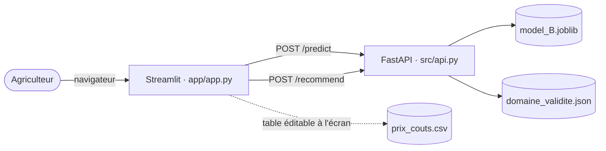
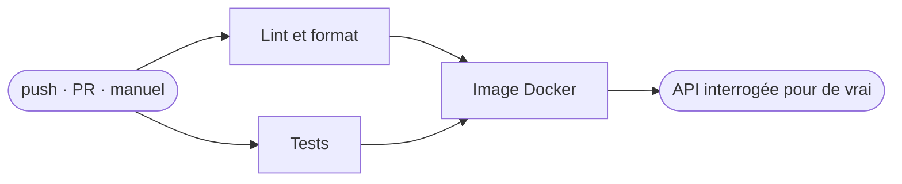

<a id="readme-top"></a>

[![CI][ci-shield]][ci-url]
[![Python][python-shield]][python-url]
[![FastAPI][fastapi-shield]][fastapi-url]
[![Streamlit][streamlit-shield]][streamlit-url]
[![Docker][docker-shield]][docker-url]
[![MLflow][mlflow-shield]][mlflow-url]

<br />
<div align="center">
  <a href="https://github.com/KL38/OC_P12">
    
  </a>

  <h3 align="center">Prédiction de rendements & moteur de recommandation de culture</h3>

  <p align="center">
    Un modèle unique, servi par une API, interrogé par une interface — pour aider un
    agriculteur à choisir quoi semer.
    <br />
    <a href="#à-propos-du-projet"><strong>Découvrir le projet »</strong></a>
    <br />
    <br />
    <a href="#démarrage">Démarrage</a>
    &middot;
    <a href="#pipeline-cicd">Pipeline CI/CD</a>
    &middot;
    <a href="#le-modèle">Le modèle</a>
  </p>
</div>

<details>
  <summary>Sommaire</summary>
  <ol>
    <li>
      <a href="#à-propos-du-projet">À propos du projet</a>
      <ul>
        <li><a href="#architecture">Architecture</a></li>
        <li><a href="#construit-avec">Construit avec</a></li>
      </ul>
    </li>
    <li>
      <a href="#démarrage">Démarrage</a>
      <ul>
        <li><a href="#prérequis">Prérequis</a></li>
        <li><a href="#installation">Installation</a></li>
      </ul>
    </li>
    <li><a href="#utilisation">Utilisation</a></li>
    <li><a href="#pipeline-cicd">Pipeline CI/CD</a></li>
    <li><a href="#le-modèle">Le modèle</a></li>
    <li><a href="#structure-du-dépôt">Structure du dépôt</a></li>
    <li><a href="#feuille-de-route">Feuille de route</a></li>
    <li><a href="#contact">Contact</a></li>
    <li><a href="#sources-et-remerciements">Sources et remerciements</a></li>
  </ol>
</details>

## À propos du projet

L'application remplit deux fonctions complémentaires, au sein d'une même interface :

- **Prédiction** — l'utilisateur choisit une culture, décrit les conditions de sa région,
  et obtient une estimation chiffrée du rendement attendu.
- **Recommandation** — l'utilisateur ne décrit que ses conditions, et l'application classe
  les dix cultures par rentabilité estimée.

C'est **un seul modèle appelé deux fois différemment** : `/recommend` n'est rien d'autre
que `/predict` exécuté sur les dix cultures d'un même contexte, suivi d'une couche métier.
Aucun second modèle, aucun second entraînement.

Les prix ne transitent jamais par l'API. Elle rend des **rendements** ; la marge se calcule
dans l'interface, à partir d'un tableau que l'agriculteur ajuste à son exploitation.
Modifier un prix reclasse l'affichage sans relancer la moindre requête.

### Architecture



Deux garde-fous distincts, et la distinction est volontaire :

| Mécanisme | Ce qu'il traite | Réponse |
|---|---|---|
| **Pydantic** | l'impossible physiquement — pluie négative, −300 °C, culture inconnue | `422`, champ fautif nommé, rien n'est prédit |
| **Domaine de validité** | l'invraisemblable agronomiquement — du manioc à 5 °C | `200` avec `cultivable: false` et le motif |

### Construit avec

* [![Python][python-shield]][python-url]
* [![FastAPI][fastapi-shield]][fastapi-url]
* [![Streamlit][streamlit-shield]][streamlit-url]
* [![scikit-learn][sklearn-shield]][sklearn-url]
* [![MLflow][mlflow-shield]][mlflow-url]
* [![Docker][docker-shield]][docker-url]
* [![uv][uv-shield]][uv-url]

<p align="right">(<a href="#readme-top">retour en haut</a>)</p>

## Démarrage

### Prérequis

Au choix, selon la façon de lancer :

* **Docker** — c'est tout. [Docker Desktop](https://docs.docker.com/get-started/get-docker/)
* **ou** Python 3.12 et [uv](https://docs.astral.sh/uv/getting-started/installation/)

### Installation

```sh
git clone git@github.com:KL38/OC_P12.git
cd OC_P12
```

Le modèle entraîné (`models/model_B.joblib`, 217 Ko) est versionné : rien à télécharger,
rien à réentraîner pour lancer l'application.

<p align="right">(<a href="#readme-top">retour en haut</a>)</p>

## Utilisation

### Avec Docker — recommandé

Une commande, les deux services :

```sh
docker compose up --build
```

| Service | Adresse |
|---|---|
| Interface | <http://localhost:8501> |
| API | <http://localhost:8000> |
| Documentation interactive de l'API | <http://localhost:8000/docs> |

L'interface n'est lancée qu'une fois l'API déclarée saine — Compose attend que
`/health` réponde, donc que le modèle soit chargé.

### Sans Docker

```sh
uv sync

# terminal 1
uv run uvicorn src.api:app --reload

# terminal 2
uv run streamlit run app/app.py
```

### L'API en ligne de commande

```sh
curl -X POST http://localhost:8000/predict \
  -H 'content-type: application/json' \
  -d '{"pluie_mm": 1030, "temperature_c": 20.4, "pesticides_kg_ha": 0.9, "culture": "Maize"}'
```

| Route | Méthode | Rôle |
|---|---|---|
| `/health` | GET | état du service, cultures connues, réserve à afficher |
| `/predict` | POST | une culture → un rendement en t/ha |
| `/recommend` | POST | un contexte → les dix cultures, classées |

### Les tests

```sh
uv run pytest tests -v
```

<p align="right">(<a href="#readme-top">retour en haut</a>)</p>

## Pipeline CI/CD

Un workflow, [`.github/workflows/ci.yml`](.github/workflows/ci.yml), dont l'état est le
badge en haut de cette page.

### Déclencheurs

| Événement | Quand |
|---|---|
| `push` | sur `main` uniquement |
| `pull_request` | sur toute branche |
| `workflow_dispatch` | à la demande, depuis l'onglet Actions |

### Les trois jobs



| Job | Ce qu'il garantit |
|---|---|
| **Lint & format** | aucune erreur ni code mort dans `src`, `tests`, `app` ; mise en forme uniforme |
| **Tests** | 26 tests, dont la **portabilité de l'artefact** vérifiée dans un interpréteur neuf |
| **Image Docker** | les deux images se construisent, la pile démarre, **et l'API prédit réellement** |

`Lint` et `Tests` tournent **en parallèle**. `Image Docker` attend les
deux pour ne pas construire une image à partir d'un code dont les tests échouent.

### Ce que le job d'image vérifie vraiment

Le job monte l'image, puis appelle
l'API : `/health`, qui doit renvoyer `"statut":"ok"`, et `/predict` un rendement.

### En cas d'échec

Le workflow s'arrête au premier job rouge et GitHub notifie l'auteur du push. Le job
d'image ajoute une étape `docker compose logs` conditionnée à l'échec.

Le déploiement continu est **hors périmètre**, un choix assumé : le brief le qualifie
d'« optionnel mais fortement recommandé », mais la démonstration repose sur
`docker compose up`, qui ne dépend d'aucun service tiers.

<p align="right">(<a href="#readme-top">retour en haut</a>)</p>

## Le modèle

**HistGradientBoosting** entraîné sur `log(rendement)`, sélectionné parmi cinq familles de
modèles au terme de 14 expérimentations suivies dans MLflow.

### La validation groupée par pays plutôt que aléatoire

Toute la modélisation repose sur une décision prise avant le premier entraînement :
**le modèle ne doit pas apprendre les pays par cœur**. La pluviométrie est constante par
pays sur 1990-2013 (η² = 100 %) et la température quasi (99,6 %) : le couple
(pluie, température) **reconstitue le pays exactement**. Un même pays des deux côtés d'un
découpage transforme l'évaluation en consultation de table.

Deux outils, une seule raison : `GroupShuffleSplit` met 22 pays de test de côté en amont,
`GroupKFold` garantit qu'aucun pays n'est à cheval sur deux plis pendant la validation
croisée.

**Le tableau ci-dessous ne compare que des scores de validation croisée**, tous mesurés sur
les mêmes 87 pays d'entraînement, avec les mêmes hyperparamètres : seul le découpage des
plis change.

| Modèle | R² sous `GroupKFold` | R² sous `KFold` aléatoire | Écart |
|---|---|---|---|
| `DummyRegressor` — *témoin* | −0,164 | −0,160 | **+0,004** |
| Ridge | 0,415 | 0,594 | +0,179 |
| Lasso | 0,412 | 0,563 | +0,151 |
| RandomForest | 0,480 | **0,932** | +0,452 |
| CatBoost | 0,533 | 0,918 | +0,385 |
| **HistGradientBoosting** | **0,566** | 0,889 | +0,323 |

Le témoin rend la lecture indiscutable : un modèle qui n'apprend rien obtient le **même**
score sous les deux protocoles (−0,164 contre −0,160). Les deux découpages sont donc d'égale
difficulté, et tout l'écart des autres lignes est de la **mémorisation** — le modèle
reconnaît des pays qu'il a déjà vus.

Deux lectures s'imposent :

- **Le classement s'inverse.** RandomForest est premier en aléatoire (0,932) et seulement
  **troisième** en groupé (0,480) : une sélection en CV aléatoire aurait retenu le modèle
  qui généralise le plus mal aux pays inconnus. HistGradientBoosting fait le trajet inverse.
- **Plus un modèle est aléatoire, plus il mémorise.** +0,15 à +0,18 pour les linéaires,
  +0,32 à +0,45 pour les arbres, +0,004 pour le témoin qui ne peut rien mémoriser.

Annoncer un chiffre aléatoire aurait été plus flatteur et sans valeur : en production,
l'utilisateur décrit une région que le modèle n'a jamais rencontrée. Tous les chiffres
ci-dessous sont donc les chiffres groupés, les plus bas, et les seuls honnêtes.

| | Valeur |
|---|---|
| Protocole de validation croisée | `GroupKFold(5)` **par pays** |
| R² validation croisée — avant optimisation | 0,566 |
| R² validation croisée — **après optimisation** | **0,595** |
| R² test — 22 pays jamais vus | **0,627** |
| RMSE test | **4,94 t/ha** |
| MAE test | 2,85 t/ha |
| Entraînement | 11 550 lignes, 87 pays, 1990-2013, 10 cultures |
| Test | 2 821 lignes, 22 pays **jamais vus** |

Les deux premières lignes sont des moyennes sur 5 plis de pays d'entraînement ; la
troisième est un passage unique sur des pays mis de côté avant tout entraînement. Que le
test (0,627) dépasse la validation croisée (0,595) tient à la variance d'échantillonnage :
les 22 pays tirés sont un peu plus faciles que la moyenne des plis (±0,078 d'un pli à
l'autre).

### Ce qui pèse dans la prédiction

Importance par permutation sur les 22 pays de test, en points de RMSLE perdus quand une
colonne est remplacée par du bruit. Elle mesure si le modèle a **raison** de se servir
d'une variable — pas s'il s'en sert.

| Variable | Importance | σ (20 répétitions) | 
|---|---|---|
| Culture (`Item`) | **+0,709** | 0,010 |
| Pesticides | +0,120 | 0,006 | 
| Température | +0,033 | 0,002 | 
| Année | +0,008 | 0,008 | 
| Pluviométrie | −0,004 | 0,002 |

- **La culture (`Item`) domine tout** : 0,71 point de RMSLE perdu, contre 0,12 pour les pesticides et 0,03 pour la température. C'est le η² = 53 % de l'EDA, retrouvé côté modèle.
- **La pluviométrie n'apporte aucune précision sur un pays inconnu** : −0,004, c'est-à-dire zéro (le léger négatif est du bruit d'échantillonnage). Cohérent avec l'EDA : une seule valeur par pays, jamais de variation interne — le modèle l'a apprise comme **signature du pays**, pas comme variable agronomique, et une signature ne généralise pas. C'est la justification a posteriori du protocole groupé.
- **Sensibilité n'est pas utilité — le faux paradoxe de l'app** : dans Streamlit, bouger le curseur pluviométrie déplace la prédiction. Normal : changer la pluie fait ressembler la saisie à un autre pays de l'entraînement, et le modèle applique le niveau de rendement mémorisé de ce « pays »-là. La sortie **bouge**, mais ces déplacements n'apportent aucune précision mesurable sur un pays jamais vu — c'est une limite assumée du modèle, pas un signal agronomique validé.
- La pluviométrie reste pourtant dans le modèle servi : c'est une saisie utilisateur de `/recommend`, et son rôle **validé** est ailleurs — le filtre de domaine de validité s'appuie dessus pour bloquer les recommandations incohérentes, pas pour ajuster le chiffre prédit.
- `Year` ne pèse presque rien (0,008) : cohérent avec la décision de transmettre l'année réelle sans correction — l'arbre sature sur son dernier seuil appris.

Trois contrôles confirment la neutralité de la variable pluie :

| Contrôle | Résultat |
|---|---|
| **Ablation** — réentraîner sans la pluviométrie | test R² 0,627 → 0,635 · CV groupé 0,595 → 0,567 · neutre |
| **Desserrer le modèle** — 255 feuilles, L2 = 0,01 | test R² 0,627 → **0,552** · pluviométrie à −0,022 |
| **Contraindre les interactions** — `interaction_cst` | test R² 0,627 → **0,313** |

Les deux derniers méritent d'être soulignés : donner **plus** de capacité au modèle
**aggrave** le problème, la capacité supplémentaire servant à mémoriser plus finement la
correspondance pluviométrie → pays. Les hyperparamètres serrés retenus par la recherche ne
sont pas une limite subie, ce sont la réponse correcte au protocole groupé par pays.

### Ce que le modèle rapporte

Un moteur de recommandation ne vaut que s'il bat un **conseil unique** — « semer partout la
culture la plus rentable en général », qui ne demande aucun modèle. Les deux conseillers
sont comparés sur les **488 situations** (pays, année) du jeu de test où plusieurs cultures
ont réellement été observées, puis payés avec le profit **effectivement constaté** sur
place. Le modèle n'est donc jamais jugé sur ses propres prédictions.

| Conseil suivi | Profit réel moyen | Médiane |
|---|---|---|
| Conseil unique — la même culture partout | 2 263 \$/ha | 1 756 \$/ha |
| **Modèle** — la culture au meilleur profit prédit localement | **2 344 \$/ha** | **1 910 \$/ha** |
| Meilleur choix possible — repère théorique | 2 629 \$/ha | 2 029 \$/ha |

> **Suivre le modèle rapporte +81 \$/ha, soit +3,6 %.** C'est le gain anticipé de
> `/recommend`.

- Le modèle désigne la meilleure culture dans **57 %** des situations, le conseil unique
  dans 52 %.
- Dans **9 situations sur 10 les deux conseils coïncident** : tout se joue sur les **54
  désaccords**, où le modèle fait mieux **42 fois**. Le gain paraît modeste en relatif
  parce qu'il ne se matérialise que sur 11 % des cas — mais il ne coûte rien à
  l'agriculteur : c'est le même semis, décidé autrement.
- **Inde 2007** — le conseil unique désigne Potatoes, qui rapporte 1 298 \$/ha sur place.
  Le modèle, voyant que le climat local défavorise la pomme de terre, désigne Cassava :
  **3 933 \$/ha réels**, le meilleur choix possible cette année-là.
- Le modèle reste ~285 \$/ha sous l'optimum théorique — l'atteindre supposerait de
  connaître les rendements à l'avance.

Le classement est filtré **avant** d'être trié : une culture hors de son domaine observé
est écartée, jamais silencieusement reléguée. Sans ce filtre, l'igname arriverait en tête
de 77 % des situations alors qu'elle ne pousse que dans 57 % d'entre elles.

### Limites connues

- Les données s'arrêtent en **2013**. Un modèle à base d'arbres sature sur sa dernière
  coupure : une prédiction pour 2026 est identique à celle de 2013. L'année réelle est
  transmise sans correction de tendance, et l'interface affiche une réserve permanente.
- Les trois variables d'entrée sont des **agrégats nationaux**, pas des mesures de
  parcelle. Les curseurs sélectionnent un profil de référence.
- La table prix/coûts est une **hypothèse** documentée, ajustable à l'écran. C'est la
  comparaison entre cultures qui porte l'information, pas la valeur absolue en dollars.

<p align="right">(<a href="#readme-top">retour en haut</a>)</p>

## Structure du dépôt

```
├─ src/                     # partagé entre le notebook et l'API
│  ├─ preprocessing.py       #   build_features + ClippedExp
│  └─ api.py                 #   FastAPI, 3 routes
├─ app/
│  ├─ app.py                 # Streamlit, 2 onglets, aucune logique ML
│  ├─ prix_couts.csv         # prix et coûts par défaut, éditables à l'écran
│  └─ Dockerfile
├─ models/
│  ├─ model_B.joblib         # le modèle servi (versionné)
│  └─ domaine_validite.json  # bornes climatiques par culture
├─ notebooks/
│  ├─ df.csv                # dataset consolidé — la source de vérité (versionné)
│  ├─ EDA *.ipynb           # exploration et fusion des trois sources
│  └─ ML CYPD.ipynb         # benchmark, optimisation, MLflow, volet économique
├─ tests/                   # 26 tests
├─ .streamlit/config.toml   # thème, aux couleurs du logo
├─ Dockerfile               # image de l'API, multi-étage
└─ docker-compose.yml       # les deux services
```

`src/preprocessing.py` est **partagé** entre le notebook d'entraînement et l'API : ce qui
construit le modèle doit être exactement ce qui le sert, sinon les deux divergent — et la
divergence ne se manifeste que par des prédictions fausses en production.

<p align="right">(<a href="#readme-top">retour en haut</a>)</p>

## Feuille de route

- [x] Étape 1 — Exploration, fusion et préparation des deux jeux de données
- [x] Étape 2 — Modélisation, optimisation et suivi MLflow
- [x] Étape 3 — API FastAPI et conteneurisation
- [x] Étape 4 — Interface Streamlit
- [x] Étape 5 — Tests et build automatisés

<p align="right">(<a href="#readme-top">retour en haut</a>)</p>

## Contact

Kevin L — [github.com/KL38](https://github.com/KL38)

Projet réalisé dans le cadre du parcours **Data Scientist / Machine Learning
Engineer** d'OpenClassrooms — mission « Concevez un système de recommandation avec
intégration de données multi-sources ».

<p align="right">(<a href="#readme-top">retour en haut</a>)</p>

## Sources et remerciements

### Les jeux de données

Le **dataset consolidé** issu de l'Étape 1 est versionné : [`notebooks/df.csv`](notebooks/df.csv),
1,3 Mo, 14 371 lignes, 109 pays, 10 cultures, 1990-2013. C'est la source de vérité des
étapes suivantes, et elle suffit à rejouer l'entraînement.

Les **trois sources brutes**, elles, ne le sont pas — 117 Mo, dont un fichier de 90 Mo à
lui seul. Elles ne servent qu'à rejouer la fusion de l'Étape 1, et ne sont **pas
nécessaires** pour lancer l'application ni pour réentraîner le modèle.

Fournies avec l'énoncé de la mission, à replacer selon cette arborescence :

```
data/
├─ Agriculture Crop Yield/
│  └─ crop_yield.csv                     # rendements par culture et par région
├─ Crop Yield Prediction Dataset/
│  ├─ pesticides.csv                     # usage de pesticides, en tonnes
│  ├─ rainfall.csv                       # pluviométrie annuelle
│  ├─ temp.csv                           # température moyenne
│  └─ yield.csv, yield_df.csv            # rendements FAO
└─ LandUse/
   └─ Inputs_LandUse_E_All_Data*.csv     # FAO — surfaces agricoles
```

La troisième source sert à ramener les pesticides d'un volume national en tonnes à une
**intensité en kg/ha**, seule forme comparable d'un pays à l'autre.

### Remerciements

* [Best-README-Template](https://github.com/othneildrew/Best-README-Template) — structure de ce document
* [FAOSTAT](https://www.fao.org/faostat/) — données de surfaces agricoles

<p align="right">(<a href="#readme-top">retour en haut</a>)</p>

[//]: # (Badge natif de GitHub et non shields.io : le dépôt est privé, et shields.io)
[//]: # (interroge l'API publique — il répondrait « repo or workflow not found ». GitHub,)
[//]: # (lui, sert le badge avec la session du lecteur, donc il s'affiche pour qui a accès.)
[//]: # (À rebasculer sur shields.io si le dépôt passe public, pour un style homogène.)
[ci-shield]: https://github.com/KL38/OC_P12/actions/workflows/ci.yml/badge.svg?branch=main
[ci-url]: https://github.com/KL38/OC_P12/actions/workflows/ci.yml
[python-shield]: https://img.shields.io/badge/Python-3.12-3776AB?style=for-the-badge&logo=python&logoColor=white
[python-url]: https://www.python.org/
[fastapi-shield]: https://img.shields.io/badge/FastAPI-009688?style=for-the-badge&logo=fastapi&logoColor=white
[fastapi-url]: https://fastapi.tiangolo.com/
[streamlit-shield]: https://img.shields.io/badge/Streamlit-FF4B4B?style=for-the-badge&logo=streamlit&logoColor=white
[streamlit-url]: https://streamlit.io/
[sklearn-shield]: https://img.shields.io/badge/scikit--learn-F7931E?style=for-the-badge&logo=scikitlearn&logoColor=white
[sklearn-url]: https://scikit-learn.org/
[mlflow-shield]: https://img.shields.io/badge/MLflow-0194E2?style=for-the-badge&logo=mlflow&logoColor=white
[mlflow-url]: https://mlflow.org/
[docker-shield]: https://img.shields.io/badge/Docker-2496ED?style=for-the-badge&logo=docker&logoColor=white
[docker-url]: https://www.docker.com/
[uv-shield]: https://img.shields.io/badge/uv-DE5FE9?style=for-the-badge&logo=uv&logoColor=white
[uv-url]: https://docs.astral.sh/uv/
