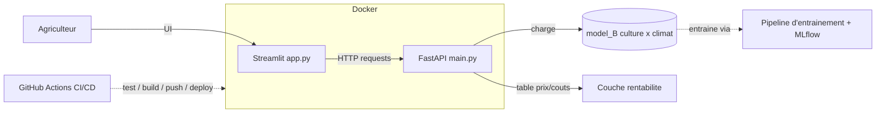

# Plan de projet — P12 : Prédiction de rendements & recommandation de culture

> **v4 — le dataset A est écarté de la modélisation.** Tout le produit repose désormais sur le dataset B
> (FAO), audité et corrigé. Le dataset A reste dans le projet, mais uniquement comme **démonstration
> d'audit** : la preuve qu'il ne peut pas porter une recommandation est le résultat analytique le plus fort
> du projet, et elle justifie la bascule.
>
> Cette version intègre aussi les corrections issues de la revue complète du notebook `EDA CYPD.ipynb`
> (§1), et une nouvelle section **§13 — Limites** qui cadre ce que le modèle peut et ne peut pas affirmer.
>
> *Historique : v3 — révisé après l'audit du dataset B. v2 — révisé après audit factuel des données.*

---

## 0. Objectif & architecture cible

Livrer un **prototype web** qui, à partir d'un contexte agricole, permet :
- **Prédiction** : culture choisie + contexte → rendement estimé (t/ha) ;
- **Recommandation** : contexte seul → classement des cultures par rentabilité décroissante.

Un seul modèle, entraîné sur le dataset B, sert les deux endpoints. Architecture découplée, containerisée,
avec CI/CD :



**Pourquoi un seul modèle** — les deux endpoints doivent parler la même langue. Voir §2 et §3 : `model_A`
et `model_B` ne partageaient ni le vocabulaire de cultures, ni les ordres de grandeur.

---

## 1. Les données

### Dataset B — le jeu de travail *(`Crop Yield Prediction Dataset` + FAOSTAT Land Use)*

`yield_df.csv` est livré « prêt à l'emploi » mais **ne doit pas être utilisé tel quel**. L'audit
(`EDA CYPD.ipynb`) a mis au jour six défauts, chacun mesuré :

| # | Défaut | Mesure |
|---|---|---|
| 1 | **`temp.csv` est au niveau station, pas pays** (52 relevés pour les USA en 1925, de 5,2 à 23,3 °C). La jointure a dupliqué chaque ligne de rendement. | 28 242 lignes pour **13 130 combinaisons uniques** → **54 % de doublons** |
| 2 | **Deux conventions de nommage** : `yield.csv`/`pesticides.csv` en noms FAO, `rainfall.csv`/`temp.csv` en noms courants | **USA, Chine et Russie absents** du fichier livré (USA 121 743 hg/ha, Chine 88 820, contre ~70 500 de moyenne) |
| 3 | **Collision `China`** : `yield.csv` contient l'agrégat `China` (continent + HK + Macao + Taïwan) *et* `China, mainland` | après renommage, 384 lignes en double sur la même clé — l'agrégat doit être écarté **avant** le mapping |
| 4 | `" Area"` avec espace initial, valeurs `".."`, colonnes `year`/`country`, encodage UTF-8 (`Türkiye`) | échecs de fusion silencieux |
| 5 | **2003 absente de `rainfall.csv`** | **23 années effectives**, pas 24 |
| 6 | Les 3 variables d'entrée sont des **agrégats nationaux**, pas des mesures de parcelle | la pluviométrie est même **constante par pays** |

> ⚠️ **Corrections v4 par rapport à la v3** : le point 3 (collision `China`) et le point 5 (année 2003)
> n'étaient pas identifiés. Et l'affirmation « les USA ont le rendement le plus élevé du jeu » était
> **fausse** : ils sont **31ᵉ sur 212**. Le chiffre 121 743 hg/ha est bon, la superlative ne l'était pas.

**Périmètre retenu : `B_enriched` — 14 371 lignes, 109 pays, 10 cultures, 1990-2013 (23 ans), aucun NaN.**

**3ᵉ source ajoutée — FAOSTAT *Land Use*** (`data/LandUse/`). `pesticides_tonnes` est un tonnage national
qui mélange taille du pays et intensité des pratiques. Rapporté à la surface `Cropland`, on obtient une
**intensité en kg/ha** agronomiquement juste (Inde 0,27 · Australie 1,41 · USA 2,36 · Brésil 2,56 ·
France 4,34 · Belgique 7,81). Couverture **100 %**.

### Ce que l'EDA de B a établi

| Constat | Chiffre | Conséquence |
|---|---|---|
| **`Item` explique 53,2 % de la variation du rendement** (η² = SCE/SCT) | contre 20,6 % pour `Area`, 0,8 % pour `Year` | **c'est là qu'est le signal** |
| **Cible à queue droite épaisse** | skewness 2,11 → **−0,20 en log** | entraîner sur `log(cible)` |
| **Les 917 « outliers » sont tous des tubercules** | 917 → 370 avec la règle appliquée par culture | ne rien supprimer |
| **`pesticides_kg_per_ha` = meilleure variable numérique** | +0,31 global, **+0,51 intra-culture**, jusqu'à +0,66 | mais lien **entre pays**, voir §13 |
| **Aucune réponse à la pluviométrie n'est estimable** | variance intra-pays = **0 %** (109/109 pays) | voir §13 |
| **(pluie, température) identifie le pays sans ambiguïté** | 0 cas sur 2 287 ; 108 valeurs de pluie pour 109 pays | source de mémorisation, voir §5 |
| Le signe des corrélations **s'inverse selon la culture** | pluie : +0,42 (igname) à −0,17 (patate douce) | **les interactions culture × climat sont le signal** |
| Distributions très asymétriques | `pesticides_kg_per_ha` skew 5,8 · `cropland_1000ha` 3,8 | log pour les linéaires, inutile pour les arbres |
| Effectifs déséquilibrés par culture | Yams 477 lignes contre Potatoes 2 270 | fiabilité inégale, à signaler dans l'UI |
| Couverture non uniforme (culture × climat) | à 10 °C et 600-1000 mm, **7 cultures sur 10** documentées | impose le filtre de validité du §7 |
| **L'ACP ne compresse rien** | `[0,298 · 0,221 · 0,194 · 0,182 · 0,105]`, 4 composantes = 89,5 % | corrélations inter-variables ≤ 0,36 |

### Rendements réels par culture *(médiane et moyenne sur `B_enriched`)*

| Culture | Médiane t/ha | Moyenne t/ha |
|---|---|---|
| Potatoes | **16,00** | 18,16 |
| Cassava | 10,00 | 10,37 |
| Plantains and others | 9,53 | 10,63 |
| Yams | 9,15 | 10,15 |
| Sweet potatoes | 8,65 | 10,45 |
| Rice, paddy | 3,47 | 3,80 |
| Maize | 2,52 | 3,77 |
| Wheat | 2,41 | 3,03 |
| Soybeans | 1,62 | 1,65 |
| Sorghum | **1,26** | 1,86 |

> ⚠️ **Correction v4** : la table équivalente en v3 était calculée sur `yield_df.csv` **avec ses doublons**
> (Cassava y apparaissait à 15,05 au lieu de 10,37, Potatoes à 19,98 au lieu de 18,16). Les chiffres
> ci-dessus sont post-audit.

Rapport de **1 à 12** entre le sorgho et la pomme de terre. C'est cet écart qui porte le projet — et c'est
exactement ce que le dataset A n'a pas.

### Dataset A — écarté de la modélisation, conservé comme démonstration

| Fait | Valeur vérifiée |
|---|---|
| Dimensions | 1 000 000 × 10, 0 NaN, 0 doublon |
| Granularité | parcelle — ni pays, ni année |
| Cultures (6) | Barley, Cotton, Maize, Rice, Soybean, Wheat — **parfaitement équilibrées** |
| Cible | min −1,148 / moy 4,649 / max 9,963 / σ 1,697 → 231 valeurs négatives |

**Le processus générateur est identifiable.** Les 3 variables numériques suivent des lois **uniformes
exactes et indépendantes**, et l'OLS reconstitue le générateur à la décimale :

```
Yield ≈ 0,005·Rainfall + 0,02·Temperature + 1,5·Fertilizer + 1,2·Irrigation + N(0 ; 0,50)
```

Vérification directe sur les données : `Fertilizer_Used` donne **+1,500 t/ha** exactement (3,900 → 5,400)
et `Irrigation_Used` **+1,200 t/ha** exactement (4,050 → 5,250). Ce sont, au millième près, les
coefficients du générateur.

> **Conséquence importante** : présenter ces « uplifts » comme des résultats agronomiques reviendrait à
> republier les **paramètres d'entrée de la simulation** en les faisant passer pour des faits mesurés.
> C'est le genre de chose qui se démonte en une question. À ne pas faire.

---

## 2. Pourquoi le dataset A est écarté

Le plan v1 prévoyait : *« le modèle prend contexte + crop ; on itère sur les 6 cultures et on trie »*.
**Testé — ça ne marche pas.** Trois preuves indépendantes.

**Preuve 1 — rendement moyen par culture (1 M lignes)**
`Barley 4,647 · Cotton 4,651 · Maize 4,641 · Rice 4,651 · Soybean 4,654 · Wheat 4,653`
→ étendue **0,0130 t/ha** pour un σ de 1,697.

**Preuve 2 — permutation importance** (HistGradientBoosting, 300 k lignes, R² 0,9117)

```
Rainfall_mm            1,17249
Fertilizer_Used        0,39512
Irrigation_Used        0,24546
Temperature_Celsius    0,01441
Soil_Type              0,00001
Days_to_Harvest        0,00000
Weather_Condition     -0,00000
Crop                  -0,00002   <- negatif = pire que du hasard
Region                -0,00002
```

**Preuve 3 — simulation directe de `/recommend`** (contexte fixé, on fait varier la culture)

```
Barley 5,8406 | Rice 5,8406 | Wheat 5,8406 | Cotton 5,8405 | Maize 5,8405 | Soybean 5,8405
etendue du classement = 0,0001 t/ha        RMSE du modele = 0,5033 t/ha
```

Le classement est **5 000× plus petit que la barre d'erreur du modèle**. Sur 200 contextes tirés au hasard,
le « gagnant » est aléatoire.

### Et trois raisons de plus, découvertes en v4

Même en gardant A pour le seul endpoint `/predict` (l'option « R1 » des versions précédentes), l'assemblage
ne tient pas :

**1. Vocabulaire incompatible.** Sur les 10 cultures de B, **6 n'existent pas dans A** : Potatoes, Cassava,
Yams, Plantains, Sweet potatoes, Sorghum. Or ce sont précisément les tubercules qui monopolisent le podium
de `/recommend`. Concrètement : l'utilisateur reçoit « plantez des pommes de terre », clique sur `/predict`,
et `model_A` n'a jamais vu cette modalité. **La sortie de `/recommend` n'est pas une entrée admissible de
`/predict`.** Dans l'autre sens, Barley et Cotton n'existent pas dans B.

**2. Échelles incompatibles** sur les 4 cultures qui se mappent :

| Culture | A (toutes cultures) | B réel (médiane) | Facteur |
|---|---|---|---|
| Rice → Rice, paddy | 4,65 | 3,47 | 1,3× |
| Maize → Maize | 4,64 | 2,52 | 1,8× |
| Wheat → Wheat | 4,65 | 2,41 | 1,9× |
| Soybean → Soybeans | 4,65 | 1,62 | **2,9×** |

A surestime toutes les céréales et sous-estime la pomme de terre d'un facteur 3,4 (4,65 contre 16,0). Deux
chiffres contradictoires sur le même écran, sans explication défendable.

**3. Le repli « uplift documenté » est circulaire** — voir §1, les +1,500 et +1,200 t/ha sont les
coefficients du générateur.

### ✅ Dataset B, lui, porte le signal culture

| Features | R² (à re-mesurer, cf. §5) |
|---|---|
| climat seul (pluie, température, pesticides) | **0,128** |
| climat + **`Item`** | **0,946** |
| climat + Item + Year + Area | 0,979 |

`Item` fait passer le R² de 0,13 à 0,95 : **c'est la variable structurante**. Et le classement **réagit au
contexte** (vraies interactions culture × climat) :

```
sec & chaud    (400 mm, 28 °C) -> Potatoes 14,4 | Plantains 10,3 | Sweet potatoes 10,3 | Yams 9,0
humide & chaud (2500 mm, 26 °C)-> Cassava 14,0  | Potatoes 12,0  | Yams 11,8           | Plantains 9,6
tempere        (900 mm, 12 °C) -> Potatoes 22,3 | Cassava 15,9   | Plantains 15,0      | Yams 9,8
```

> ⚠️ Ces R² ont été produits avant les corrections v3/v4 (dédoublonnage, collision `China`). Les ordres de
> grandeur restent valides, mais **les chiffres définitifs seront ceux de l'Étape 2**, mesurés sous les
> trois protocoles du §5.

### Ce que devient le dataset A dans le projet

- **Notebook `01`** : l'audit de signal ci-dessus. C'est le résultat analytique le plus fort du projet et il
  se raconte en une slide. Il justifie toute l'architecture.
- **Livrable « dataset unifié »** : toujours produit (§4), il documente le lien entre les deux sources.
- **Aucun `model_A` en production.** Il peut rester dans MLflow comme run de comparaison, mais il ne sert
  aucun endpoint.

---

## 3. Architecture de modélisation — **décidée**

> **Un seul modèle, entraîné sur `B_enriched`, sert les deux endpoints.**
> - `/predict` : culture + contexte → rendement estimé (t/ha)
> - `/recommend` : contexte → les 10 cultures scorées, filtrées par domaine de validité, classées par
>   rentabilité

*+* Cohérence totale : même unité, même vocabulaire de cultures, mêmes ordres de grandeur entre les deux
écrans. Un seul schéma d'entrée dans l'UI. Un seul modèle à maintenir, versionner, déployer.

*−* On s'écarte du cadrage du brief, qui désigne A comme base de modélisation. **L'écart se défend avec les
preuves du §2** — c'est un meilleur livrable qu'un modèle qui tourne sans rien vouloir dire.

*−* Le pipeline ne rencontre plus la question du volume (14 k lignes au lieu de 1 M). Compensé par le fait
que l'EDA de A, elle, traite bien le million de lignes.

---

## 4. Étape 1 — EDA, fusion, préparation

| Notebook | Rôle | Sortie |
|---|---|---|
| `01_eda_datasetA.ipynb` | EDA de A + **audit de signal du §2** (moyennes par modalité, permutation importance, générateur reconstitué, ACP). Conclut à l'écartement de A. Échantillonnage pour les plots. | `A_clean.parquet` |
| `02_eda_datasetB.ipynb` | ✅ **fait** (`EDA CYPD.ipynb`), revu en v4. Audit des 5 fichiers, reconstruction et **correction** de la fusion, intégration du Land Use, conversion hg/ha → t/ha. | `B_original` / `B_corrected` / `B_enriched` |
| `03_fusion.ipynb` | Mapping des noms de cultures A↔B, agrégats B par culture, **livrable « dataset unifié »**, ACP en contraste A vs B. | `dataset_unifie.csv` |
| `04_feature_engineering.ipynb` | FE du §5, **DF model-agnostic** (pas de scaling ici). | `train_ready.parquet` + `summary_choix.md` |

**Décisions Étape 1 :**
- **Parquet** en intermédiaire ; CSV uniquement pour le livrable imposé.
- **Ne pas sur-nettoyer** : `B_enriched` a 0 NaN et 0 doublon par construction, c'est le résultat de l'audit.
- **Aucun outlier supprimé** dans B : les 917 signalés sont des tubercules, pas des anomalies.
- **ACP — cadrage du narratif.** Le brief l'exige pour « identifier les variables clés ». Résultat mesuré :
  scree plot plat sur A (`[0,334 ; 0,333 ; 0,332]`) **et** sur B (`[0,298 ; 0,221 ; 0,194 ; 0,182 ; 0,105]`,
  corrélations ≤ 0,36). Deux scree plots identiques, **deux causes opposées** : dans A parce que le
  générateur a tiré des variables indépendantes, dans B parce que chaque variable capte une facette
  différente d'un même pays. On montre l'ACP, on conclut qu'elle n'identifie pas les variables clés ici, et
  on les identifie autrement — corrélations intra-culture et η². Ça se raconte en une slide.

---

## 5. Étape 2 — Feature engineering & entraînement

### Le principe qui commande tout

Range les colonnes par niveau de variation :

| Niveau | Variables |
|---|---|
| Fixe par **pays** | pluie (**exactement**), température (99,6 %), surface cultivée (99,8 %) |
| Bouge par **pays × année** | pesticides (79,2 % inter-pays, **21 % intra**) |
| Bouge par **pays × culture × année** | **la cible, et elle seule** |

> **Le nombre effectif d'exemples pour apprendre l'effet du climat n'est pas 14 371, c'est 109.**
> Chaque ligne d'un même pays répète le même climat. C'est la raison mécanique de l'effondrement du R² sur
> des pays jamais vus, et le fait le plus important à garder en tête pour tout ce qui suit.

### Feature engineering — les 7 décisions

**1. Sortir `cropland_1000ha` des variables du modèle.** 99,8 % inter-pays, Spearman avec la cible
**−0,003**. Aucun signal, mais une dimension d'empreinte de pays en plus. Elle reste l'**ingrédient** de
`pesticides_kg_per_ha`, rien de plus.

**2. Garder `Year` à l'entraînement, transmettre l'année réelle à l'inférence.** Contre-intuitif mais
essentiel : si on retire l'année, **la tendance temporelle est absorbée par les pesticides**, puisque les
deux montent ensemble (§13). Le modèle dirait alors « les pesticides font monter le rendement » —
exactement l'erreur qu'on veut éviter. Garder `Year` protège le reste du modèle.

À l'inférence, **aucune date codée en dur** : l'API transmet l'année courante. Le finaliste est HistGB, et
un arbre plafonne sur son dernier seuil, appris sur des données arrêtées en 2013 — la prédiction pour 2026
est donc **identique, au bit près**, à celle de 2013. Figer la date ne changerait aucun résultat, tandis
qu'une constante `2013` dans le code laisserait croire à un traitement qui n'existe pas. Le décalage
temporel est porté par un **disclaimer dans l'application** (§7), pas par une constante.

> ⚠️ **Hypothèse assumée** : ce choix repose sur une famille de modèles **à base d'arbres**. Un modèle
> linéaire, lui, extrapolerait 13 ans de tendance dans le vide. Décision prise en connaissance de cause, à
> réexaminer si la famille de modèle change.

**Aucune correction de tendance n'est appliquée.** Les rendements progressent de **+1,34 %/an** dans les
données (médiane 3,62 → 4,95 t/ha entre 1990 et 2013), soit **~+19 % cumulés** entre 2013 et 2026 : le
modèle sous-estime donc vraisemblablement d'autant, et de façon **systématique** — c'est un biais orienté,
pas du bruit. Corriger reviendrait à extrapoler une tendance 13 ans au-delà des observations sans pouvoir
la valider : de la fausse précision. La vraie réponse est un réentraînement sur données récentes ; à
défaut, on **annonce** le biais.

*Mesure disponible* : le protocole temporel (§ ci-dessous) chiffre exactement cette situation — entraîné
jusqu'en 2008, le modèle sature et applique son comportement de 2008 aux années suivantes. Coût constaté
sur 5 ans d'horizon : **+34 % de RMSE** (2,60 → 3,48). L'application en demande 13, c'est donc un plancher.

**3. Découper les pesticides en deux colonnes** (décomposition intra/inter, dite de Mundlak) :
- `pesticides_pays_moyen` — moyenne du pays sur la période : le **niveau d'intensification** ;
- `pesticides_ecart` — écart de l'année à cette moyenne : « cette année-là, plus ou moins que d'habitude ».

On a montré (§13) que la première porte le lien — confondu avec le développement du pays — et que la
seconde ne porte rien. Les séparer **rend visible** ce que le modèle utilise : les importances montreront
qu'il s'appuie sur la composante « pays » et ignore la composante « pratique ». Excellent matériau de
soutenance.
*Bonus* : le même découpage sur la pluie donne une colonne « écart » **exactement nulle partout** — la
démonstration la plus visuelle possible du problème.

**4. Entraîner sur `log(cible)`.** Les cultures vont de 1,26 à 16 t/ha ; sans log, l'erreur est dominée par
les pommes de terre et le modèle néglige le soja. En log, les erreurs deviennent relatives (« ±15 % »
plutôt que « ±2 t/ha »), ce qui est le bon cadrage métier.
*Détail à connaître* : repasser en t/ha par exponentielle redonne la **médiane**, pas la moyenne. Sans
importance pour un classement, et c'est même plutôt ce qu'on veut afficher.

**5. Les interactions culture × climat sont le signal.** C'est l'inverse exact du dataset A. Preuve : le
lien pluie ↔ rendement vaut +0,42 sur l'igname et −0,17 sur la patate douce. Les arbres les captent
nativement. Un baseline linéaire a besoin de **termes d'interaction `Item × climat` explicites**, sinon il
est structurellement mal spécifié.

**6. Ne fabriquer aucune nouvelle variable au niveau pays.** Zone climatique par clustering de (pluie,
température), indice d'aridité, ratio pluie/température : tout ça a l'air agronomique mais n'est qu'un
identifiant de pays reformulé — rappel, le couple (pluie, température) désigne le pays sans ambiguïté,
0 cas sur 2 287.

**7. Garder la pluviométrie**, malgré son statut d'identifiant de pays. Les versions précédentes
proposaient de tester son retrait pour limiter la mémorisation. L'idée reste mesurable, mais un obstacle
produit domine : **c'est une saisie de l'utilisateur**. Sans elle, `/recommend` ne répond plus qu'à la
température. On la garde, et on documente ce qu'elle fait réellement (§13).

**Encodage** : `Item` (10 modalités) en catégorielle native pour LightGBM/HistGB, one-hot pour les
linéaires. `Area` exclue du modèle applicatif — décision cosmétique côté apprentissage puisque le climat
reconstruit le pays, mais elle évite un sélecteur de 109 pays dans l'UI.

### Protocoles d'évaluation — trois chiffres à annoncer

| Protocole | Ce qu'il mesure | Attendu |
|---|---|---|
| Split aléatoire (sur données dédoublonnées) | plafond optimiste | ~0,93 |
| **`GroupKFold` par pays** | généralisation à un **pays inconnu** | ~0,54 |
| **Split temporel** (train ≤ 2008, test 2009-2013) | généralisation **dans le temps** | à mesurer |

Le troisième est nouveau en v4 et il est très pertinent : l'application tourne en 2026 sur des données qui
s'arrêtent en 2013.

> **L'écart 0,93 / 0,54 n'est pas un défaut à corriger, c'est la mesure du phénomène décrit au §13.** La
> moitié du R² apparent est du lookup d'empreinte climatique, pas de l'apprentissage climat → rendement.
> C'est le chiffre à annoncer quand on demandera la robustesse.

### Modèles & optimisation

**Shortlist retenue :** `DummyRegressor` (plancher) · `Ridge`/`Lasso` (avec interactions explicites) ·
`RandomForestRegressor` (contraste bagging/boosting) · `HistGradientBoostingRegressor` (cheval de
bataille) · **`CatBoostRegressor`** (challenger).

**Familles écartées, et pourquoi.** La question « peut-on faire plus performant, ou utiliser CUDA ? » a été
instruite ; la réponse est non, et pour des raisons qui tiennent à la structure des données :

- **LightGBM et XGBoost** — redondants. `HistGradientBoostingRegressor` est la réimplémentation
  scikit-learn de l'approche histogramme de LightGBM ; les trois sont statistiquement indiscernables une
  fois tunés sur ce type de données.
- **Deep learning tabulaire** (TabNet, FT-Transformer) — la littérature est constante sur ce régime de
  taille : Grinsztajn et al. (NeurIPS 2022), Shwartz-Ziv & Armon (2022), McElfresh et al. (NeurIPS 2023).
  Les GBDT dominent, les réseaux souffrant d'un biais vers des fonctions trop lisses et d'une sensibilité
  aux variables peu informatives — on en a plusieurs.
- **GPU / CUDA** — contre-productif. Sur 14 371 lignes × 6 colonnes, le coût fixe de transfert mémoire et
  de lancement de kernels dépasse le gain de calcul ; l'accélération GPU des GBDT ne devient rentable
  qu'au-delà de ~100 k lignes. Seul **TabPFN** (Hollmann et al., *Nature* 2025) utiliserait le GPU
  légitimement, mais nos 14 371 lignes dépassent sa zone de confort et la dépendance GPU alourdirait
  l'image Docker de l'Étape 3 pour un gain nul sur le chiffre qui compte.

> **L'argument décisif.** L'écart R² 0,93 → 0,54 entre split aléatoire et split par pays n'est **pas un
> déficit de capacité de modèle** : c'est le mur d'information du §13 — 109 profils climatiques effectifs,
> pas 14 371. Changer de famille déplacerait le 0,93 vers peut-être 0,935, et laisserait le 0,54 intact.
> La sophistication améliorerait le chiffre qui ne compte pas.

**Pourquoi CatBoost et pas un autre challenger.** C'est le seul avec un argument de fond plutôt que de
notoriété : *ordered target statistics* pour les catégorielles et *ordered boosting* contre le biais de
prédiction (Prokhorenkova et al., NeurIPS 2018). L'avantage est atténué sur `Item` (10 modalités), mais il
devient réel sur la variante « avec `Area` » (109 modalités) gardée comme borne supérieure dans MLflow. Il
est aussi robuste à ses paramètres par défaut, ce qui en fait un bon point de comparaison face à un HistGB
tuné. Dépendance ajoutée : `uv add catboost`.

- **Les arbres devraient gagner ici**, à cause des interactions culture × climat. C'est l'inverse du
  dataset A où l'OLS gagnait parce que le générateur était additif — le contraste se raconte bien.
- **L'optimisation d'hyperparamètres doit tourner sous `GroupKFold` par pays**, jamais en CV aléatoire.
  Sinon on sélectionne la configuration qui **mémorise le mieux** les empreintes de pays : le HPO
  optimiserait exactement ce qu'on cherche à éviter. Piège discret et coûteux.
- **Régulariser plus que d'habitude** : 14 371 lignes mais 109 profils climatiques. Limiter la profondeur,
  monter `min_samples_leaf`.
- **Log sur `pesticides_kg_per_ha`** pour les modèles linéaires uniquement (skew 5,8). Inutile pour les
  arbres.
- **Prédire un intervalle, pas un point.** Avec un R² de 0,54 hors pays connus, une valeur unique est une
  promesse que le modèle ne tient pas. → voir « Quantification d'incertitude » ci-dessous.

### Quantification d'incertitude — où va le budget « avancé »

C'est ici, et non dans la capacité du modèle, que la sophistication paie sur ce problème.

**Prédiction conforme** (Vovk ; Angelopoulos & Bates 2021) via **MAPIE**, un projet `scikit-learn-contrib`.
Ce n'est pas un modèle mais une **couche** qui s'enroule autour du modèle retenu : elle transforme une
prédiction ponctuelle en intervalle avec **garantie de couverture en échantillon fini**, sans hypothèse de
distribution. Un modèle médiocre donne des intervalles plus larges, jamais une garantie fausse.

API v1 (vérifiée — elle a changé depuis les versions 0.x) :

```python
from mapie.regression import SplitConformalRegressor

mapie = SplitConformalRegressor(model, confidence_level=0.95)
mapie.fit(X_train, y_train)            # entraîne
mapie.conformalize(X_calib, y_calib)   # calibre sur un jeu séparé
y_pred, y_pis = mapie.predict_interval(X_test)
```

> ⚠️ **La calibration doit être groupée par pays**, via un `GroupShuffleSplit` construit à la main — MAPIE
> n'expose pas de paramètre `groups`. Calibrer sur un split aléatoire donnerait des intervalles **trop
> étroits** : le modèle connaît déjà ces pays, ses erreurs de calibration sont artificiellement basses.
> Même précaution que pour le `GroupKFold` de l'évaluation.

Bénéfice annexe : **l'écart de largeur d'intervalle entre pays connus et pays inconnus est une mesure
directe** de la limite documentée au §13.

*Statut : décidé sur le principe, à implémenter une fois un modèle en place — MAPIE s'enroule autour d'un
modèle existant, rien à installer avant (`uv add mapie` le moment venu).*

**MLflow :** une expérience `crop_yield_B`. Un run par modèle/config, log params + **RMSE, MAE, R² sous les
trois protocoles** + artefact modèle + importances. Seed fixé partout. Screenshots `.png`.

**Logging des modèles — une seule flavor.** `mlflow.sklearn.log_model` couvre toute la shortlist,
**CatBoost compris** : chaque modèle étant emballé dans un `TransformedTargetRegressor` pour la cible en
log, l'objet entraîné est un estimateur scikit-learn. `mlflow.catboost` ne s'appliquerait qu'à un
`CatBoostRegressor` nu et échouerait sur l'emballage. Toujours passer `signature=` et `input_example=` :
`Item` est une colonne `category`, et ce dtype ne survit pas à un aller-retour JSON au moment de servir le
modèle à l'Étape 3.

**Sortie :** `model_B.joblib`, `metrics.json`, `05_training.ipynb` (ou `train.py`).

---

## 6. Étape 3 — API FastAPI + Docker

**Endpoints :** `POST /predict` · `POST /recommend` · `GET /health`. Validation Pydantic.

Côté API : `Year` = **année courante**, jamais codée en dur (§5), clip à 0 des prédictions négatives,
filtre de domaine de validité sur `/recommend` (§7).

### 🅰️ Docker Compose local vs 🅱️ Déploiement cloud

| | 🅰️ Compose local | 🅱️ Cloud |
|---|---|---|
| **Pour** | Reproductible, zéro coût, **démo soutenance offline fiable**, familier (P9) | Satisfait pleinement l'Étape 5, **URL live**, CI/CD end-to-end |
| **Contre** | Stage « deploy » sans cible réelle | Free tiers qui *cold-start*, secrets, quotas |

> **✅ DÉCISION RETENUE : hybride.** Compose local = démo garantie (fallback) · CI build + push sur Docker
> Hub · Front → Streamlit Community Cloud · API → Render / HF Spaces (bonus).

### 💰 Rentabilité — obligatoire, pas optionnel

Classer par t/ha bruts n'a aucun sens agronomique : la pomme de terre sort première avec **16 t/ha**
médians dans **tous** les contextes climatiques, simplement parce que c'est un tubercule. Sans pondération
économique, `/recommend` n'est qu'un tri par densité de matière.

> **✅ Décision : `profit = prix × rendement − coût`, porté par Streamlit à l'étape 4.** Vérifié — il
> n'existe **aucune donnée de prix ni de coût** dans les trois sources. Les prix producteurs sont
> téléchargeables chez FAOSTAT, mais les coûts de production n'existent dans aucune source ouverte
> harmonisée : cette moitié restera une hypothèse quoi qu'il arrive. Or le calcul est un simple produit —
> il n'a pas besoin de vivre dans le modèle. **Une table de 10 lignes éditable dans l'interface suffit**, et
> isole l'hypothèse là où l'utilisateur la voit et peut la challenger.

**Livrables :** `main.py`, `Dockerfile`, `requirements.txt`.

---

## 7. Étape 4 — Front-end Streamlit

`app.py`, **aucune logique ML** (appelle l'API via `requests`) :
- Toggle **Prédiction / Recommandation** ;
- sliders + selectbox pour le contexte ; bouton → requête API ;
- affichage : **chiffre + intervalle** (prédiction) / **bar chart + table triés** (recommandation) ;
- **table prix/coûts éditable** (10 lignes) pour la rentabilité ;
- gestion d'erreur si l'API est indisponible.

### ✅ Décision produit — les curseurs se comportent comme un simulateur

Les curseurs climatiques fonctionnent comme dans n'importe quel prototype : on les déplace, la prédiction
change. **C'est une simplification assumée**, pas un oubli.

Ce que ça implique, et qui doit être tenu :

1. **Une ligne de microcopie sous les curseurs** — quelque chose comme *« Les valeurs décrivent un profil
   climatique national de référence. Le modèle compare des pays entre eux : voir les limites dans le
   rapport. »* Ça coûte une ligne, et ça transforme un raccourci en choix documenté.
2. **La limite est traitée en entier dans le rapport métier et en soutenance** (§13). C'est l'engagement qui
   rend le raccourci acceptable.
3. **Libellés honnêtes** : « pluviométrie annuelle de votre **région** », pas « de votre parcelle ». Les
   trois variables sont des agrégats nationaux.

> **Pourquoi c'est défendable.** Un prototype interactif est le livrable attendu, et aucun modèle entraîné
> sur ces données ne pourrait faire mieux — la limite est dans les données, pas dans le travail. Ce qui
> distingue un bon projet d'un mauvais, ce n'est pas d'éviter la limite, c'est de **l'avoir identifiée,
> mesurée et déclarée**. Le §13 est précisément ce livrable-là.

### Autres contraintes d'UX imposées par l'EDA

- **⚠️ Filtre de domaine de validité sur `/recommend`** : toutes les cultures ne poussent pas partout. Dans
  un contexte tempéré (10 °C, 600-1000 mm), seules **7 cultures sur 10** ont des observations réelles —
  manioc, igname et plantain n'en ont aucune. Un modèle à base d'arbres ne refuse jamais de prédire : il
  rabattrait sur la feuille la plus proche et renverrait un rendement de pays chaud, plausible à l'écran et
  infondé. Ne classer que les cultures observées dans une fenêtre climatique proche, en s'appuyant sur les
  **percentiles p5/p95**.
- **⚠️ Fiabilité inégale selon la culture** : de 477 observations (Yams) à 2 270 (Potatoes). Afficher une
  réserve sur les cultures peu documentées.
- **⚠️ Disclaimer temporel** — la contrepartie de la décision n°2 du §5 (pas de date figée, pas de
  correction de tendance). À afficher en permanence, pas dans un pli dépliable :

  > *Le modèle s'appuie sur des données agricoles mondiales couvrant 1990-2013. Il décrit la relation
  > entre climat, intrants et rendement telle qu'observée sur cette période — il ne projette pas les
  > progrès agronomiques survenus depuis. Les rendements ayant augmenté d'environ 1,3 %/an sur la période
  > observée, les valeurs affichées sont vraisemblablement **sous-estimées d'environ 20 %** aujourd'hui.
  > À utiliser pour **comparer des cultures entre elles**, pas comme objectif chiffré absolu.*

  Les deux endpoints n'y sont pas exposés de la même façon, et c'est ce qui rend cette formulation
  défendable : `/predict` renvoie une valeur absolue, directement touchée ; `/recommend` renvoie un
  **classement**, largement préservé puisque le biais joue dans le même sens pour toutes les cultures.
  Largement, pas totalement — les tendances diffèrent (maïs +2,61 %/an contre plantain +0,36 %/an), donc
  le gel relatif défavorise les cultures en progrès rapide. À mentionner en soutenance si la question
  vient.

**Livrables :** `app.py`, `requirements.txt`.

---

## 8. Étape 5 — CI/CD *(à mettre en place dès le départ)*

`.github/workflows/ci.yml` :
1. **Test** : `pytest` sur les fonctions critiques (schémas Pydantic, logique `/recommend`, filtre de
   validité, chargement modèle) + `ruff`.
2. **Build** : image Docker API à chaque push.
3. **Push/Deploy** : Docker Hub + déclenchement du déploiement.

Secrets via GitHub Secrets. Badges de statut au README. Notifications d'échec. Doc du pipeline (schéma +
triggers) pour le rapport.

---

## 9. Structure du dépôt

```
OC_P12/
├─ data/                     # ⚠️ 97 Mo — À GITIGNORER
├─ notebooks/                # 01..05
├─ src/
│  ├─ preprocessing.py       # FE réutilisé (notebooks + API)
│  ├─ train.py               # entraînement + MLflow
│  └─ api/
│     ├─ main.py             # FastAPI
│     └─ schemas.py          # Pydantic
├─ app/                      # Streamlit (app.py)
├─ models/                   # model_B.joblib
├─ tests/                    # pytest
├─ docker/                   # Dockerfile(s) + docker-compose.yml
├─ .github/workflows/ci.yml
├─ reports/                  # rapport .pdf + screenshots MLflow
├─ pyproject.toml            # UV
└─ README.md
```

**🔴 Action immédiate — `.gitignore`.** `crop_yield.csv` fait **90 Mo** : sous la limite dure de GitHub
mais au-dessus du seuil d'avertissement, et il alourdirait définitivement l'historique. Ignorer `data/`,
`mlruns/`, `models/*.joblib`, `.venv/`, `*.parquet` ; documenter la provenance des datasets dans le README
et garder un échantillon versionné (~5 000 lignes) pour que la CI puisse tourner.

**Outillage :** UV (`uv add …`), Python 3.12, `ruff`, `pytest`, seeds fixés partout.

---

## 10. Fil rouge livrables

- [ ] Screenshots MLflow `.png`
- [ ] Notebooks/scripts pipeline entraînement `.ipynb`/`.py`
- [ ] Pipeline MLOps `.py`/`.yaml` (+ Dockerfile)
- [ ] Pipeline CI/CD `.yaml`
- [ ] Rapport métier `.pdf` (résultats, variables clés, recommandations, **+ section limites du §13**)
- [ ] Support de soutenance (15 min / 10 min / 5 min)

---

## 11. Risques & points de vigilance

| Risque | Statut | Traitement |
|---|---|---|
| **`Crop` sans effet dans A** | 🔴 confirmé | A écarté de la modélisation (§2, §3) |
| **Classement dominé par le tonnage** (tubercules) | 🔴 confirmé | Table prix/coûts (§6) |
| **Doublons de `yield_df.csv` → fuite de données** | 🔴 confirmé | `temp.csv` agrégé par pays ; `GroupKFold` à l'évaluation |
| **Collision `China` / `China, mainland`** | 🔴 **nouveau v4** | Écarter l'agrégat **avant** le mapping + `assert` d'unicité de clé |
| **HPO qui optimise la mémorisation** | 🟠 **nouveau v4** | Recherche d'hyperparamètres sous `GroupKFold` par pays (§5) |
| **`Year` extrapolée à 2026** | 🟢 **sans objet** | HistGB est un arbre : il plafonne, prédiction 2026 = prédiction 2013 au bit près. Rien à figer (§5) |
| **Modèle daté — biais à la baisse ~19 % en 2026** | 🟠 **nouveau v4** | Assumé : aucune correction, disclaimer permanent dans l'app (§7), chiffré par le protocole temporel (§5) |
| **Dtype `category` perdu à la sérialisation JSON** | 🟠 **nouveau v4** | `signature=` + `input_example=` au `log_model`, sinon panne découverte au déploiement (§5) |
| **R² surestimé par mémorisation d'empreinte** | 🟠 confirmé | Annoncer les 3 chiffres (§5) ; expliquer par le §13 |
| **Recommandation hors domaine climatique** | 🟠 confirmé | Filtre de validité p5/p95 (§7) |
| **Aucun levier causal dans les données** | 🟠 confirmé | Simplification produit assumée (§7) + section §13 |
| Variables d'entrée = agrégats nationaux | 🟠 confirmé | Libellés régionaux + microcopie + rapport |
| **90 Mo dans git** | 🔴 aucun `.gitignore` | À créer avant le premier commit (§9) |
| 2003 absente du jeu | 🟡 mineur | 23 années, à ne pas annoncer comme 24 |
| Encodage UTF-8 des fichiers FAOSTAT | 🟡 | `encoding="utf-8"` explicite, sinon perte silencieuse de pays |
| Free tiers instables en démo | 🟡 | Compose local en fallback |
| Reproductibilité | 🟢 | seeds, `uv.lock`, MLflow |

---

## 12. ⛳ Décisions

| # | Décision | Statut | Contenu |
|---|---|---|---|
| 1 | **Architecture de modélisation** (§3) | ✅ **tranchée v4** | **Un seul modèle sur B** sert les deux endpoints. A écarté de la modélisation, conservé comme audit |
| 2 | **Rentabilité** (§6) | ✅ tranchée | `prix × rendement − coût`, table de 10 lignes éditable dans Streamlit |
| 3 | **Déploiement** (§6) | ✅ tranchée | Hybride : Compose local fiable + cloud bonus |
| 4 | **`Area` dans le modèle** (§5) | ✅ tranchée | Exclue — motif d'**interface** (éviter 109 pays dans l'UI). Côté apprentissage c'est cosmétique : le climat reconstruit le pays |
| 5 | **`.gitignore`** (§9) | 🔴 à faire **avant le 1ᵉʳ commit** | Ignorer `data/`, `mlruns/`, modèles |
| 6 | **Périmètre du dataset B** (§1) | ✅ tranchée | `B_enriched` : 14 371 l., 109 pays, 23 ans, intensité en kg/ha |
| 7 | **3ᵉ source (Land Use)** (§1) | ✅ tranchée | Intégrée, couverture 100 % |
| 8 | **Curseurs climatiques dans l'UI** (§7) | ✅ **tranchée v4** | Comportement de simulateur **assumé**, avec microcopie + limite traitée au §13, au rapport et en soutenance |
| 9 | **Cible en log** (§5) | ✅ tranchée v4 | Entraînement sur `log(cible)`, retour en t/ha à l'affichage |
| 10 | **Shortlist de modèles** (§5) | ✅ **tranchée v4** | Dummy · Ridge/Lasso · RandomForest · HistGB · **CatBoost**. LightGBM/XGBoost écartés (redondants), deep tabulaire écarté (littérature), GPU écarté (contre-productif à cette taille) |
| 11 | **Intervalles de prédiction** (§5) | ✅ **tranchée v4** | Prédiction conforme via **MAPIE**, calibration **groupée par pays**. À implémenter après le premier modèle |

---

## 13. ⚠️ Limites du modèle — ce qu'il peut et ne peut pas affirmer

> **Section à reprendre presque telle quelle dans le rapport métier et en soutenance.** C'est le livrable
> qui rend acceptable la simplification produit du §7.

### 13.1 Le problème, en une image

Depuis 30 ans, le nombre de téléphones portables a explosé. L'espérance de vie aussi. Les deux courbes
montent ensemble — mais les téléphones ne font pas vivre plus longtemps. C'est **le temps qui passe** qui a
fait monter les deux, chacun pour ses propres raisons.

Un modèle apprend toujours des **associations** : « parmi les observations où X vaut x, Y vaut combien ? »
Il n'apprend pas des **interventions** : « si je change X, Y devient combien ? » Les deux ne coïncident que
si la variation qui a servi à estimer le lien ressemble vraiment à l'action qu'on imagine.

Sur ce jeu de données, ce n'est le cas pour **aucune** des trois variables d'entrée.

### 13.2 Ce qui identifie chaque variable

| Variable | Variance **intra-pays** | Ce sur quoi le coefficient est estimé |
|---|---|---|
| `average_rain_fall_mm_per_year` | **0 %** | uniquement des comparaisons **entre pays** |
| `avg_temp` | 0,4 % (σ intra ≈ 0,43 °C) | 99,6 % entre pays |
| `pesticides_kg_per_ha` | 21 % | mixte — **le seul cas testable** |
| `Item` (culture) | — | comparaisons **à contexte fixé** ✅ |

**Démonstration concrète, sur le maïs.** En découpant la pluviométrie en déciles :

```
decile 3 (pluie basse) -> Argentine, Bielorussie, Bulgarie, Hongrie, Pologne...   4,53 t/ha
decile 7 (pluie haute) -> Albanie, Bahamas, Burundi, Centrafrique, Haiti...       1,58 t/ha
```

L'écart de 3 t/ha est **réel**, mais il ne mesure pas la pluie : il sépare la ceinture céréalière
européenne d'un groupe de pays peu mécanisés. Le curseur pluviométrie est un curseur « niveau de
développement agricole » déguisé en curseur météo.

### 13.3 Pourquoi aucun meilleur modèle ne réglerait ça

D'habitude, quand une variable est confondue par le pays, on **contrôle le pays**. Ici c'est impossible :
la pluviométrie a un η² de **100 %** avec le pays, c'est-à-dire qu'elle lui est **parfaitement colinéaire**.
Contrôler le pays ne laisse strictement aucune variance résiduelle pour estimer un coefficient de pluie.

L'alternative est stricte, sans troisième option :

- soit on inclut le pays, et la pluie devient **non identifiable** ;
- soit on l'exclut, et son coefficient **absorbe tout le confondant inter-pays**.

Ce n'est pas une faiblesse d'algorithme, c'est une **impossibilité d'identification** inscrite dans la
structure des données. Corollaire : retirer la colonne `Area` ne dé-confond rien, puisque le couple
(pluie, température) reconstruit le pays sans ambiguïté — 0 cas sur 2 287.

### 13.4 Le test qu'on a pu faire, et son résultat

Les pesticides sont la seule variable qui bouge à l'intérieur d'un pays (21 % de variance intra). On a donc
posé la question du levier, directement, à l'intérieur de chaque couple *(pays, culture)* suivi au moins
dix ans — **632 séries** sur les 653 existantes, donc sans sélection déguisée :

| Corrélation intra (pays × culture) | ρ médian | positifs |
|---|---|---|
| pesticides ↔ rendement | +0,19 | 62 % |
| **année ↔ rendement** | **+0,62** | **82 %** |
| pesticides ↔ rendement, **à année constante** | **+0,03** | **53 %** |

**Deux tests de robustesse confirment que ce +0,03 est du bruit :**

1. **Test de signe** : 336 séries positives sur les 631 pour lesquelles la corrélation partielle est
   calculable, soit 53,2 %. Intervalle de confiance à 95 % : **[49,3 % ; 57,2 %]**, p = 0,111.
   **L'intervalle contient 50 %** — indiscernable du hasard.
2. **Différences premières** (méthode totalement indépendante, sans formule de corrélation partielle) :
   « quand les pesticides augmentent d'une année sur l'autre, le rendement augmente-t-il aussi ? » →
   ρ médian **−0,009**, positif dans **49 %** des cas, p = 0,605.

**Illustration — Brésil / Blé, 23 années.** La corrélation entre intensité de pesticides et **année** vaut
**+0,999** : l'usage monte chaque année sans exception, l'intensité est devenue une horloge. Sur les 0,885
de corrélation apparente avec le rendement, **0,875 s'expliquent par le seul fait que les deux montent avec
le temps**. Il reste 0,010.

> **Conclusion.** Le lien pesticides ↔ rendement mesuré (+0,51 intra-culture) est **vrai**, mais il compare
> des pays entre eux : les pays riches et intensifs mettent plus de pesticides *et* récoltent plus. Ce sont
> deux symptômes du même niveau de développement agricole. Les pesticides sont un **marqueur
> d'intensification**, pas un levier démontré.

### 13.5 Ce que le modèle peut affirmer, par ordre de solidité

| | Affirmation | Statut |
|---|---|---|
| 1 | « À ce climat, la pomme de terre rend plus que le sorgho » | ✅ **solide** — comparaison entre cultures à contexte fixé, η² 53 %, interaction culture × climat démontrée |
| 2 | « Les pays au climat X obtiennent Y pour la culture Z » | ✅ **solide mais descriptif** — bien estimé, c'est un constat, pas une loi |
| 3 | « Si le climat de ta région devenait X, ton rendement deviendrait Y » | ❌ **non identifiable** — la variation n'existe pas dans les données |
| 4 | « Si tu augmentais ton usage de pesticides, ton rendement monterait » | ❌ **testé, et le test dit non** (§13.4) |

**Les points 3 et 4 sont ceux que l'interface laisse implicitement croire.** C'est la simplification assumée
de la décision n°8 (§7). Elle est acceptable **à condition** que cette section figure au rapport et soit
énoncée en soutenance.

### 13.6 La bonne formulation de ce que fait l'application

- `/recommend` **est l'endpoint sain** : il compare des cultures **à climat fixé**, sans intervenir sur
  quoi que ce soit. C'est exactement l'opération que les données supportent — `Item` porte 53 % de la
  variance et l'interaction culture × climat est réelle (le signe de la corrélation pluie s'inverse selon
  la culture). Le podium qui change avec le climat reflète bien quelles cultures prospèrent où.
- `/predict` répond « **rendement typique d'un pays à ce profil climatique, pour cette culture** », et non
  « ce que va rendre ta parcelle ». Les curseurs **sélectionnent un contexte de référence**, ils ne
  simulent pas un changement.

### 13.7 Ce qu'il faudrait pour faire mieux

Des données **au niveau parcelle**, ou au minimum un panel **infra-national** avec une vraie variation des
pratiques dans le temps et dans l'espace. Aucune des trois sources ne le permet : `temp.csv` n'a ni
identifiant de station ni coordonnées, la pluviométrie est une normale climatique nationale, et les
pesticides sont un tonnage pays. C'est hors du périmètre du projet, et c'est la bonne réponse à donner si
la question est posée.

### 13.8 Comment le présenter en soutenance

Le point fort n'est pas d'avoir évité la limite — elle est dans les données, aucun modèle ne l'éviterait.
Le point fort est de l'avoir **cherchée, mesurée et déclarée** :

> « J'ai trouvé une corrélation de +0,51 entre intensité de pesticides et rendement. Plutôt que de la
> présenter comme un levier, j'ai construit le test qui vérifie si elle tient à l'intérieur d'un pays, une
> fois la tendance temporelle neutralisée. Elle tombe à +0,03, avec un intervalle de confiance qui contient
> le hasard, et une seconde méthode indépendante confirme. Donc je l'annonce comme un marqueur
> d'intensification, pas comme une recommandation d'épandage. »

C'est plus solide que la plupart des projets, qui présenteraient le +0,51 comme un résultat.

---

### 📌 Notes d'origine (conservées)

> **Étape 1** — 4 notebooks : 1 EDA/cleaning par dataset + 1 fusion + 1 feature engineering → DF prêt à
> l'entraînement. *(→ conservé, §4 ; l'audit de signal s'ajoute au notebook 01.)*
> **Étape 2** — plusieurs modèles ; 1 notebook/modèle ou tout dans un ? *(→ §5 : un seul notebook, un
> `sklearn.Pipeline` par modèle pour gérer les spécificités de préprocessing, une seule expérience MLflow.)*
> **Étape 3** — FastAPI ; Docker local (comme P9/NBA) ou déploiement ? *(→ §6, décision hybride.)*
> **Étape 4** — RAS, classique. *(→ §7 — deux contraintes s'ajoutent : filtre de validité et microcopie.)*
> **Étape 5** — RAS, à faire et maintenir dès le départ. *(→ §8.)*
