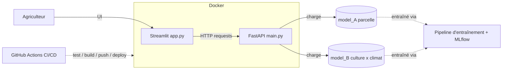

# Plan de projet — P12 : Prédiction de rendements & recommandation de culture

> **v2 — révisé après audit factuel des données** (scripts de vérif : voir §12).
> Tout ce qui était « supposé » en v1 a été testé. Trois hypothèses de la v1 étaient fausses,
> dont une qui **casse la fonctionnalité centrale du projet** (§2). Ce plan intègre les corrections.

---

## 0. Objectif & architecture cible

Livrer un **prototype web** qui, à partir des conditions d'une parcelle, permet :
- **Prédiction** : culture choisie + conditions → rendement estimé (t/ha) ;
- **Recommandation** : conditions seules → classement des cultures par rentabilité décroissante.

Architecture découplée, containerisée, avec CI/CD :



---

## 1. État des lieux des données *(vérifié par exécution, pas supposé)*

### Dataset A — `Agriculture Crop Yield/crop_yield.csv` (90 Mo)

| Fait | Valeur vérifiée |
|---|---|
| Dimensions | **1 000 000 × 10** |
| Valeurs manquantes | **0** |
| Doublons | **0** |
| Granularité | parcelle — ni pays, ni année |
| Cultures (6) | Barley, Cotton, Maize, Rice, Soybean, Wheat — **parfaitement équilibrées** (~166 7xx chacune) |
| Region (4) / Soil_Type (6) / Weather (3) | équilibrées aussi (250 0xx / 166 6xx / 333 xxx) |
| Cible `Yield_tons_per_hectare` | min **−1,148** / moy 4,649 / max 9,963 / σ 1,697 → **231 valeurs négatives** |

**⚠️ A n'est pas seulement « synthétique » : son processus générateur est identifiable.**
Les 3 variables numériques suivent des lois **uniformes exactes et indépendantes** :

| Variable | Plage | σ observé | σ théorique si U(a,b) |
|---|---|---|---|
| `Rainfall_mm` | 100 → 1000 | 259,85 | 900/√12 = **259,81** ✅ |
| `Temperature_Celsius` | 15 → 40 | 7,221 | 25/√12 = **7,217** ✅ |
| `Days_to_Harvest` | 60 → 149 | 25,95 | 90/√12 = **25,98** ✅ |

Régression OLS sur l'ensemble des variables (échantillon 200 k) → **R² = 0,9132**, RMSE = 0,50, avec seulement 4 coefficients non nuls. Le générateur se reconstitue à la décimale :

```
Yield ≈ 0,005·Rainfall + 0,02·Temperature + 1,5·Fertilizer + 1,2·Irrigation + N(0 ; 0,50)
```
*Contrôle : moyenne prédite 0,005·550 + 0,02·27,5 + 1,5·0,5 + 1,2·0,5 = **4,65** (observé 4,649) ;
σ prédit √(1,30² + 0,144² + 0,75² + 0,60² + 0,50²) = **1,697** (observé 1,697).*

**Conséquences directes, à assumer dans le narratif :**
- **Plafond de performance ≈ R² 0,913 / RMSE 0,50** — c'est le bruit irréductible du générateur. Aucun modèle ne fera mieux.
- `Crop`, `Region`, `Soil_Type`, `Weather_Condition`, `Days_to_Harvest` sont des **variables leurres à effet strictement nul** (voir §2).
- L'**ACP ne compressera rien** : variance expliquée mesurée = **[0,3342 ; 0,3334 ; 0,3324]** sur les 3 numériques. Orthogonalité parfaite par construction.

### Dataset B — `Crop Yield Prediction Dataset/`

| Fait | Valeur vérifiée |
|---|---|
| `yield_df.csv` | **28 242 × 7**, **101 pays**, **1990–2013**, **0 NaN** |
| Cultures (10) | Cassava, Maize, Plantains and others, Potatoes, Rice paddy, Sorghum, Soybeans, Sweet potatoes, Wheat, Yams |
| Fichiers bruts | `yield.csv` (56 717 l., 212 pays, 1961–2016) · `rainfall.csv` (6 727, 217 pays, 1985–2017) · `pesticides.csv` (4 349, 168 pays, 1990–2016) · `temp.csv` (71 311, 137 pays, **1743**–2013) |
| Pièges des bruts | `rainfall.csv` : colonne `" Area"` **avec espace initial** + **780 valeurs non numériques** (`..`) ; `temp.csv` : colonnes `year`/`country` + 2 547 NaN |

✅ **Reconstruction validée** : `yield ⋈ rainfall ⋈ pesticides ⋈ temp` en jointures internes sur `(Area, Year)` reproduit **exactement 28 242 lignes / 101 pays / 1990–2013**, 0 NaN. Le périmètre de `yield_df.csv` est le simple produit des intersections. Le notebook `02` est donc un livrable **sûr** — la validation tombera juste.

### Le nœud A ↔ B

| Dimension | Dataset A | Dataset B |
|---|---|---|
| Granularité | parcelle | pays × année × culture |
| Géo / temps | ❌ aucune | ✅ pays + année |
| Cible | `t/ha` | `hg/ha` (÷ 10 000 → t/ha) |
| Seul pont | **Crop** | **Item** |
| Recouvrement noms | **2/6 exacts** (Maize, Wheat) → **4/6 après mapping** (`Rice`→`Rice, paddy`, `Soybean`→`Soybeans`). Barley & Cotton absents de B. |

**❌ Correction v1 — les ordres de grandeur ne sont PAS cohérents.**
A attribue **4,65 t/ha à toutes les cultures**. Le réel FAO (B) :

| Culture | t/ha réel (B) | t/ha dans A |
|---|---|---|
| Potatoes | 19,98 | — |
| Cassava | 15,05 | — |
| Rice, paddy | 4,07 | 4,651 |
| Maize | 3,63 | 4,641 |
| Wheat | 3,01 | 4,653 |
| Soybeans | **1,67** | 4,654 |

L'écart réel entre cultures va de 1 à **12×**. Dans A il est de **0**. C'est le cœur du problème suivant.

---

## 2. 🚨 Finding bloquant — la recommandation ne peut pas fonctionner sur A

Le plan v1 prévoyait (§4) : *« le modèle prend contexte + crop ; on itère sur les 6 cultures et on trie »*.
**Testé — ça ne marche pas.** Trois preuves indépendantes :

**Preuve 1 — rendement moyen par culture (1 M lignes)**
`Barley 4,647 · Cotton 4,651 · Maize 4,641 · Rice 4,651 · Soybean 4,654 · Wheat 4,653` → étendue **0,013 t/ha** pour un σ de 1,70. Idem Region (4,646–4,654), Soil_Type (4,645–4,653), Weather (4,647–4,652).

**Preuve 2 — permutation importance (HistGradientBoosting, 300 k lignes, R² 0,9117)**

```
Rainfall_mm            1,17249
Fertilizer_Used        0,39512
Irrigation_Used        0,24546
Temperature_Celsius    0,01441
Soil_Type              0,00001
Days_to_Harvest        0,00000
Weather_Condition     -0,00000
Crop                  -0,00002   ← négatif = pire que du hasard
Region                -0,00002
```

**Preuve 3 — simulation directe de `/recommend`** (un contexte fixé, on fait varier la culture) :

```
Barley 5,8406 | Rice 5,8406 | Wheat 5,8406 | Cotton 5,8405 | Maize 5,8405 | Soybean 5,8405
étendue du classement = 0,0001 t/ha        RMSE du modèle = 0,5033 t/ha
```

→ **Le classement est 5 000× plus petit que la barre d'erreur du modèle.** C'est du bruit de virgule flottante.
Sur 200 contextes tirés au hasard, le « gagnant » est aléatoire : `Cotton 78 · Barley 59 · Rice 22 · Maize 18 · Wheat 17 · Soybean 6`.

> **En soutenance, Gabriel demande « pourquoi Cotton en premier ? » et il n'y a aucune réponse défendable.**
> Le moteur de recommandation — que le brief qualifie de *« notre plus grande valeur ajoutée »* — serait un générateur de nombres aléatoires. **Ce point doit être traité au niveau du plan, pas découvert en Étape 3.**

### ✅ Dataset B, lui, porte le signal culture

Modèles HGB sur B, mêmes conditions :

| Features | R² | RMSE |
|---|---|---|
| climat seul (rain, temp, pesticides) | **0,128** | 7,95 t/ha |
| climat + **`Item`** | **0,946** | 1,97 t/ha |
| climat + Item + Year | 0,955 | 1,80 t/ha |
| climat + Item + Year + Area | 0,979 | 1,24 t/ha |

`Item` fait passer le R² de 0,13 à 0,95 : **c'est la variable structurante**. Et le classement **réagit au contexte** (vraies interactions culture × climat) :

```
sec & chaud    (400 mm, 28 °C) -> Potatoes 14,4 | Plantains 10,3 | Sweet potatoes 10,3 | Yams 9,0
humide & chaud (2500 mm, 26 °C)-> Cassava 14,0  | Potatoes 12,0  | Yams 11,8           | Plantains 9,6
tempéré        (900 mm, 12 °C) -> Potatoes 22,3 | Cassava 15,9   | Plantains 15,0      | Yams 9,8
```

Le podium change avec le climat → **recommandation réellement informative**.

---

## 3. 🔑 Décision structurante n°1 — architecture de modélisation *(remplace la « stratégie de fusion » v1)*

La question n'est plus « comment fusionner » mais **« quel dataset peut répondre à quelle question »**.

**R1 — Un modèle par endpoint ✅ recommandé**
- `model_A` (A, parcelle) → **`/predict`** : conditions de parcelle → t/ha. R² ≈ 0,91. Conforme au brief (A = base de modélisation).
- `model_B` (B, FAO) → **`/recommend`** : climat → classement des cultures. R² ≈ 0,95, sensible au contexte.
- *+* Les deux endpoints sont honnêtes, les deux datasets travaillent réellement, la fusion multi-sources prend enfin un sens produit.
- *−* Deux schémas d'entrée à gérer dans l'UI. **Et surtout** : sous `/predict`, changer la culture ne change pas le chiffre → **doit être traité explicitement dans l'UI** (afficher en regard la référence réelle par culture issue de B, plutôt que de laisser croire à un bug).

**R2 — Modèle unique centré B** *(repli si le temps manque)*
Un seul modèle sur B sert les deux endpoints (`/predict` = 1 culture, `/recommend` = boucle). A ne sert plus qu'à l'EDA/ACP + l'audit du §2. On peut réinjecter A comme **uplift documenté** : `Fertilizer_Used` +38 % (3,90 → 5,40 t/ha), `Irrigation_Used` +30 % (4,05 → 5,25 t/ha) — chiffres mesurés, communicables tels quels.
*+* le plus simple, un seul modèle, schéma d'entrée unique. *−* perd sol/irrigation/fertilisation comme features, sous-exploite le dataset de 1 M lignes, s'écarte du cadrage du brief.

**R3 — A + classement statique issu de B** ❌ **rejetée, avec preuve**
`score(c) = model_A(contexte) × ratio_réel_B(c)`. Le facteur étant constant par culture, **l'ordre du classement ne change jamais** avec le contexte — or on a vérifié (§2) que le vrai classement, lui, change. On jetterait le seul signal exploitable pour ne garder qu'un palmarès figé.

> **Recommandation : R1**, avec R2 comme repli assumé. → **À valider** (§11).

### Le livrable « dataset unifié » reste dû

Il est produit dans tous les cas : A enrichi des agrégats de B par culture (rendement réel moyen, pesticides, rain/temp typiques) après mapping des noms, avec flag `has_B_context` (NaN pour Barley/Cotton). Il **documente** le lien entre les deux sources — mais on a désormais la preuve chiffrée qu'il ne peut pas, seul, porter la recommandation.

---

## 4. Étape 1 — EDA, fusion, préparation *(4 notebooks)*

| Notebook | Rôle | Sortie |
|---|---|---|
| `01_eda_datasetA.ipynb` | EDA + cleaning A. **Inclut l'audit de signal du §2** (moyennes par modalité, permutation importance, ACP) — c'est le résultat le plus important du projet. Échantillonnage pour les plots. | `A_clean.parquet` |
| `02_eda_datasetB.ipynb` | EDA B + **reconstruction de la fusion FAO** (4 CSV) validée contre `yield_df.csv` (28 242 l. attendues). Conversion hg/ha → t/ha. | `B_clean.parquet` |
| `03_fusion.ipynb` | Mapping des noms de cultures, agrégats B par culture, jointure crop-level A←B, **ACP** (A *et* B en contraste). | `dataset_unifie.csv` |
| `04_feature_engineering.ipynb` | Encodage, features dérivées, **DF model-agnostic** (pas de scaling ici). | `train_ready.parquet` + `summary_choix.md` |

**Décisions Étape 1 :**
- **Parquet** en intermédiaire (90 Mo de CSV) ; CSV uniquement pour le livrable imposé.
- **231 rendements négatifs** dans A → décision à documenter (clip à 0 recommandé : c'est la queue gaussienne du bruit du générateur, pas une erreur de saisie). 0,023 % des lignes.
- **Pièges des bruts B** à traiter explicitement : `" Area"` avec espace, `to_numeric(errors="coerce")` sur rainfall (780 `..`), renommage `year`/`country` de `temp.csv`.
- **ACP — cadrage du narratif.** Le brief l'exige pour « identifier les variables clés ». Résultat mesuré sur A : `[0,3342 ; 0,3334 ; 0,3324]`, scree plot parfaitement plat, **zéro compression possible**. Ce n'est pas un échec, c'est un **diagnostic** : on montre l'ACP, on conclut que les variables sont orthogonales par construction, et on identifie les variables clés par **corrélation à la cible + permutation importance**. La comparer à l'ACP sur B (variables réelles, corrélées) rend la démonstration.
- Ne pas sur-nettoyer A : 0 NaN, 0 doublon, rien à jeter.

---

## 5. Étape 2 — Entraînement & optimisation

> **Ta question v1 : un notebook par modèle, ou tout dans un seul ?**
> **Réponse : UN seul notebook/script**, le préprocessing spécifique à chaque modèle vivant **dans un `sklearn.Pipeline`** (`ColumnTransformer` par pipeline). Ça règle ton souci (la dernière couche de FE diffère selon le modèle) sans fragmenter : le DF de `04_` est model-agnostic, chaque `Pipeline(preprocessing + estimator)` gère ses spécificités (scaling pour linéaires/SVR, passthrough pour arbres). Tout est loggé dans **une seule expérience MLflow**.

**Shortlist :** `DummyRegressor` (baseline) · `Ridge/Lasso` · `HistGradientBoostingRegressor`/LightGBM · `RandomForest` (⚠️ lent sur 1 M lignes).

**⚠️ Attentes à calibrer dès maintenant — mesuré :**
- Sur A, **l'OLS bat le gradient boosting** : R² **0,9132** (linéaire) vs **0,9117** (HGB). Normal, le générateur est additif-linéaire. Le vainqueur de ton benchmark sera un **Ridge**, et c'est un excellent point de soutenance (« le modèle le plus simple gagne, voici pourquoi »).
- **Le plafond est à R² ≈ 0,913 / RMSE ≈ 0,50** (bruit irréductible). Inutile de chercher au-delà.
- **Corollaire important** : la soutenance demande *« quels hyperparamètres ont été décisifs ? »*. Sur A, la réponse honnête est **aucun** — et il faut pouvoir le prouver plutôt que le subir. → **Faire porter l'optimisation d'hyperparamètres sur `model_B`**, où elle a un effet réel (R² 0,13 → 0,95 selon les features, marge d'optimisation existante).

**MLflow :** deux expériences — `crop_yield_A_predict` et `crop_yield_B_recommend`. Un run par modèle/config, log params + **RMSE, MAE, R²** + artefact modèle + importances. Seed fixé partout. Screenshots `.png`.

**Sur `model_B` — décision technique :** inclure `Area` (pays) monte le R² de 0,955 → 0,979, mais impose un sélecteur de pays dans l'UI et fait porter au modèle un proxy « intensité agricole nationale ». **Recommandation : l'exclure** du modèle applicatif (garder `Item + climat + Year`), et montrer la variante avec `Area` dans MLflow comme borne supérieure.

**Sortie :** `model_A.joblib`, `model_B.joblib`, `metrics.json`, `05_training.ipynb` (ou `train.py`).

---

## 6. Étape 3 — API FastAPI + Docker

**Endpoints :** `POST /predict` · `POST /recommend` · `GET /health`. Validation Pydantic.

### 🅰️ Docker Compose local vs 🅱️ Déploiement cloud

| | 🅰️ Compose local | 🅱️ Cloud |
|---|---|---|
| **Pour** | Reproductible, zéro coût, **démo soutenance offline fiable**, familier (P9) | Satisfait pleinement l'Étape 5, **URL live**, CI/CD end-to-end |
| **Contre** | Stage « deploy » sans cible réelle | Free tiers qui *cold-start*, gestion des secrets, quotas |

> **✅ DÉCISION RETENUE : hybride.** Compose local = démo garantie (fallback) · CI build + push sur Docker Hub · Front → Streamlit Community Cloud · API → Render / HF Spaces (bonus).

### 💰 Rentabilité — ⬆️ cette décision passe de « optionnelle » à **quasi obligatoire**

En v1 c'était un raffinement. Avec `model_B`, **classer par t/ha bruts n'a plus aucun sens agronomique** : les 3 simulations du §2 mettent **Potatoes / Cassava / Yams** sur le podium dans *tous* les climats, simplement parce que ce sont des tubercules à fort tonnage (20 t/ha contre 1,7 pour le soja). Recommander « plantez des pommes de terre » quel que soit le contexte, ce n'est pas un moteur de recommandation.

- **(a) Proxy = rendement brut** — désormais **déconseillé** : produit un classement dominé par le tonnage, pas par la valeur.
- **(b) Table prix/coûts par culture** (€/t, coût/ha, paramétrable dans l'UI) → `profit = prix × rendement − coût`. Hypothèse externe **à documenter et à sourcer**, mais c'est ce qui rend le classement interprétable, et c'est exactement ce que demande le brief (« modéliser la relation entre espèces, coûts de production et profits »).

> **Recommandation : (b)**, avec les prix exposés comme paramètres modifiables dans Streamlit — l'utilisateur voit l'hypothèse et peut la challenger. Excellent matériau pour la question « quels gains anticipés ». → **À valider** (§11).

**Livrables :** `main.py`, `Dockerfile`, `requirements.txt`.

---

## 7. Étape 4 — Front-end Streamlit

`app.py`, **aucune logique ML** (appelle l'API via `requests`) :
- Toggle **Prédiction / Recommandation** ;
- sliders + selectbox pour le contexte ; bouton → requête API ;
- affichage : **chiffre clair** (prédiction) / **bar chart + table triés** (recommandation) ;
- gestion d'erreur si l'API est indisponible ;
- **⚠️ point d'UX imposé par le §2** : sous `/predict`, expliciter que le rendement estimé dépend des conditions de parcelle et non de la culture dans ce jeu de données, et afficher en regard la référence réelle FAO de la culture. Transformer la limite en information plutôt qu'en bug apparent.

**Livrables :** `app.py`, `requirements.txt`.

---

## 8. Étape 5 — CI/CD *(à mettre en place dès le départ)*

`.github/workflows/ci.yml` :
1. **Test** : `pytest` sur les fonctions critiques (schémas Pydantic, logique `/recommend`, chargement modèle) + `ruff`.
2. **Build** : image Docker API à chaque push.
3. **Push/Deploy** : Docker Hub + déclenchement du déploiement.

Secrets via GitHub Secrets. Badges de statut au README. Notifications d'échec. Doc du pipeline (schéma + triggers) pour le rapport.

---

## 9. Structure du dépôt

```
OC_P12/
├─ data/                     # ⚠️ 97 Mo — À GITIGNORER (voir ci-dessous)
├─ notebooks/                # 01..05
├─ src/
│  ├─ preprocessing.py       # FE réutilisé (notebooks + API)
│  ├─ train.py               # entraînement + MLflow
│  └─ api/
│     ├─ main.py             # FastAPI
│     └─ schemas.py          # Pydantic
├─ app/                      # Streamlit (app.py)
├─ models/                   # model_A.joblib, model_B.joblib
├─ tests/                    # pytest
├─ docker/                   # Dockerfile(s) + docker-compose.yml
├─ .github/workflows/ci.yml
├─ reports/                  # rapport .pdf + screenshots MLflow
├─ pyproject.toml            # UV
└─ README.md
```

**🔴 Action immédiate — il n'y a aucun `.gitignore` et `data/` n'est pas suivi.**
`crop_yield.csv` fait **90 Mo** : sous la limite dure de GitHub (100 Mo) mais au-dessus du seuil d'avertissement (50 Mo), et il alourdirait définitivement l'historique. Créer le `.gitignore` **avant le premier `git add`** : ignorer `data/`, `mlruns/`, `models/*.joblib`, `.venv/`, `*.parquet` ; documenter dans le README la provenance des datasets + garder un échantillon versionné (~5 000 lignes) pour que la CI puisse tourner.

**Outillage :** UV (`uv add …`), Python 3.12, `ruff`, `pytest`, seeds fixés partout.

---

## 10. Fil rouge livrables

- [ ] Screenshots MLflow `.png`
- [ ] Notebooks/scripts pipeline entraînement `.ipynb`/`.py`
- [ ] Pipeline MLOps `.py`/`.yaml` (+ Dockerfile)
- [ ] Pipeline CI/CD `.yaml`
- [ ] Rapport métier `.pdf` (résultats, variables clés, recommandations)
- [ ] Support de soutenance (15 min / 10 min / 5 min)

---

## 11. Risques & points de vigilance

| Risque | Statut | Traitement |
|---|---|---|
| **`Crop` sans effet dans A → `/recommend` dégénéré** | 🔴 **confirmé, bloquant** | Architecture R1/R2 (§3) — à trancher avant l'Étape 2 |
| **Classement dominé par le tonnage** (tubercules) | 🔴 confirmé | Table prix/coûts (§6b) |
| **ACP à variance uniforme** | 🟠 confirmé | La présenter comme diagnostic, pas comme échec (§4) |
| **Plafond R² 0,913 sur A / HPO sans effet** | 🟠 confirmé | Porter l'optimisation sur `model_B` (§5) |
| **90 Mo dans git** | 🔴 aucun `.gitignore` | À créer avant le premier commit (§9) |
| 231 rendements négatifs | 🟡 mineur | Clip à 0, documenté |
| Free tiers instables en démo | 🟡 | Compose local en fallback |
| Reproductibilité | 🟢 | seeds, `uv.lock`, MLflow |

---

## 12. ⛳ Décisions

| # | Décision | Statut | Recommandation |
|---|---|---|---|
| 1 | **Architecture de modélisation** (§3) | ⏳ **à trancher — le plus urgent** | **R1** (un modèle par endpoint) ; R2 en repli |
| 2 | **Rentabilité** (§6) | ⏳ à trancher avant l'Étape 3 | **(b)** table prix/coûts paramétrable — n'est plus optionnelle |
| 3 | **Déploiement** (§6) | ✅ tranchée | Hybride : local fiable + cloud bonus |
| 4 | **`Area` dans `model_B`** (§5) | ⏳ mineure | L'exclure du modèle applicatif |
| 5 | **`.gitignore`** (§9) | 🔴 à faire **avant le 1ᵉʳ commit** | Ignorer `data/`, `mlruns/`, modèles |

> Les décisions 1 et 2 conditionnent les Étapes 2 et 3. La décision 1 devrait être prise **pendant** le notebook `01`, une fois l'audit du §2 rejoué et vu de tes propres yeux.

**Scripts de vérification** — l'ensemble des chiffres de ce plan est reproductible par deux scripts d'audit (stats descriptives + générateur reconstitué ; feasibilité de `/recommend` + reconstruction FAO). À rapatrier dans `notebooks/` ou `scripts/audit/` quand l'env UV sera créé.

---

### 📌 Tes notes d'origine (conservées)

> **Étape 1** — 4 notebooks : 1 EDA/cleaning par dataset + 1 fusion + 1 feature engineering → DF prêt à l'entraînement. *(→ conservé tel quel, §4 ; l'audit de signal s'ajoute au notebook 01.)*
> **Étape 2** — plusieurs modèles ; 1 notebook/modèle ou tout dans un ? *(→ réponse §5 : un seul notebook + `Pipeline` par modèle.)*
> **Étape 3** — FastAPI ; Docker local (comme P9/NBA) ou déploiement ? Pours/contres. *(→ §6, décision hybride.)*
> **Étape 4** — RAS, classique. *(→ §7 — une contrainte d'UX s'ajoute, imposée par le §2.)*
> **Étape 5** — RAS, à faire et maintenir dès le départ. *(→ §8.)*
